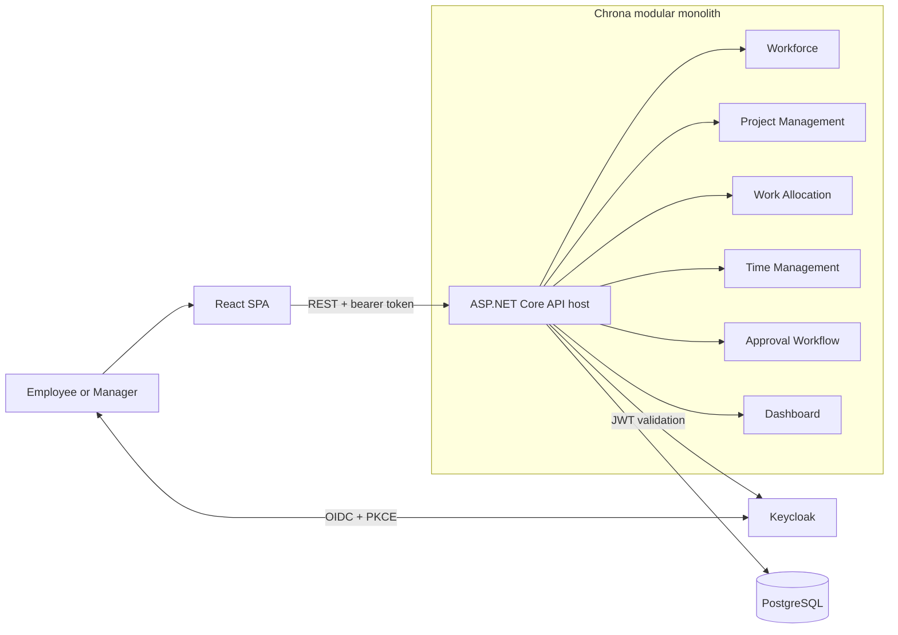

# Chrona

> A self-hosted workforce management platform for planning work, tracking actual time, and approving it with confidence.

**Chrona is in early implementation.** The v1 product, architecture, security model, API, and delivery plan are documented; the repository currently contains the first .NET foundation and local identity infrastructure. This README intentionally distinguishes what is designed from what is working today.

## What Chrona is

Chrona v1 is an internal platform for a single organization. Its core capability is **work allocation**: managers reserve employee capacity against projects, employees record the time they actually work, managers review submitted timesheets, and a dashboard exposes utilization and outstanding approvals.

The planned roles are:

- **Employees** view their allocations, record time, and submit timesheets.
- **Managers** manage workforce and projects, allocate people, review timesheets, and monitor utilization.
- **Administrators** manage accounts and roles in Keycloak rather than through a custom Chrona admin UI.

v1 deliberately excludes payroll, compensation, accounting, recruitment, CRM, inventory, and multi-tenancy. Those are not partially implemented features; they are outside this release's scope.

## Target architecture

The diagram below describes the intended v1 runtime, not the services currently running in this repository.



Chrona is designed as a **modular monolith** using Clean Architecture, Domain-Driven Design, and vertical slices. Modules own their own rules and data; cross-module collaboration happens through explicit application contracts. The Dashboard is deliberately read-only and queries live data rather than duplicating it.

The intended stack is .NET 10 / ASP.NET Core, Entity Framework Core, PostgreSQL, React, TypeScript, Tailwind CSS, shadcn/ui, Keycloak, and Docker Compose.

## What has been completed

### Product and architecture

- A full v1 system-design package has been drafted, covering scope, context, modules, 23 use cases, business processes, domain model, data model, API design, security, and deployment.
- The core domain has been identified as **Work Allocation**, with the rules around employee capacity, allocation history, timesheet approval, and auditability designed before implementation.
- A 50-day single-developer implementation plan has been written: 48 allocated days plus a two-day buffer.

### Foundation in code

- A .NET 10 solution exists with `Chrona.Shared` and a starter `Workforce` project.
- The Shared Kernel includes a base DDD `Entity` with ID-based equality.
- One xUnit test verifies the `Entity` equality behavior.
- `docker-compose.yml` starts PostgreSQL and Keycloak for local development; Keycloak is available on port `8080`.

### Not implemented yet

There is no ASP.NET Core API host, React application, Chrona database migration, domain aggregate, API endpoint, Keycloak realm/client configuration, or end-to-end user flow yet. The `Workforce` project is currently a placeholder. In other words, the foundation work has started, but Chrona is not yet a runnable workforce-management application.

## Repository layout

```text
.
|- src/
|  |- Chrona.Shared/              # Shared Kernel foundation
|  `- Workforce/                  # Starter module project
|- Tests/
|  `- Chrona.Shared.Tests/        # Current xUnit coverage
|- docs/system-design/             # v1 design package (01-15)
|- IMPLEMENTATION_ROADMAP.md       # 50-day implementation plan
|- docker-compose.yml              # Local PostgreSQL + Keycloak
`- Chrona.slnx
```

## Run the current foundation

### Prerequisites

- [.NET 10 SDK](https://dotnet.microsoft.com/download/dotnet/10.0)
- [Docker Desktop](https://www.docker.com/products/docker-desktop/) with Docker Compose

### Build and test

```bash
git clone git@github.com:ElidryssyYassineDev/Chrona.git
cd Chrona

dotnet build Chrona.slnx
dotnet test Tests/Chrona.Shared.Tests/Chrona.Shared.Tests.csproj
```

The test project is intentionally invoked directly because it is not yet part of `Chrona.slnx`.

### Start local infrastructure

```bash
docker compose up -d
```

This currently starts only PostgreSQL and Keycloak. You can reach Keycloak at [http://localhost:8080](http://localhost:8080). The checked-in `admin` / `admin` credentials and database credentials are convenience values for local development only. Replace them with injected secrets before any non-local deployment.

To stop the local infrastructure:

```bash
docker compose down
```

## What's coming

The scaffold is the beginning of Milestone 1, but the walking skeleton is not complete yet. The planned delivery sequence is:

| Milestone | Duration | Outcome |
| --- | ---: | --- |
| 1. Foundation and walking skeleton | 5 days | React and API containers, Keycloak login/logout, PostgreSQL, and `GET /api/v1/employees/me` working end to end. |
| 2. Workforce | 6 days | Employee and department management, profile view, persistence, validation, and migrations. |
| 3. Project Management | 5 days | Projects, membership, and project archiving. |
| 4. Work Allocation | 9 days | Capacity-safe allocations, history, and cancellation - the core domain. |
| 5. Time Management | 7 days | Timesheets, time entries, and submission against active allocations. |
| 6. Approval Workflow | 6 days | Manager review, approval, rejection, and timesheet reopening. |
| 7. Dashboard | 4 days | Live utilization, planned-versus-actual time, active projects, and pending approvals. |
| 8. Hardening and polish | 6 days | Consistent errors, authorization verification, responsive states, and end-to-end validation. |

See the [implementation roadmap](IMPLEMENTATION_ROADMAP.md) for the detailed sequence, definitions of done, and the reasoning behind each milestone.

## Design documentation

The design documents are currently marked **Draft - pending review** and serve as the source of truth for v1 decisions.

| Topic | Start here |
| --- | --- |
| Product scope and goals | [System overview](docs/system-design/01-system-overview.md) |
| System boundary and actors | [System context](docs/system-design/02-system-context.md) |
| Modules and dependencies | [Module design](docs/system-design/03-module-design.md) |
| User-facing behavior | [Use cases](docs/system-design/04-use-cases.md) and [business processes](docs/system-design/05-business-processes.md) |
| Domain and persistence | [Domain model](docs/system-design/06-domain-model.md), [ER diagram](docs/system-design/07-er-diagram.md), and [database design](docs/system-design/08-database-design.md) |
| Application design | [Sequence diagrams](docs/system-design/09-sequence-diagrams.md), [class diagrams](docs/system-design/10-class-diagrams.md), and [state diagrams](docs/system-design/11-state-diagrams.md) |
| Runtime and delivery | [Component diagram](docs/system-design/12-component-diagram.md) and [deployment diagram](docs/system-design/13-deployment-diagram.md) |
| API and security | [API design](docs/system-design/14-api-design.md) and [security model](docs/system-design/15-security-model.md) |

## License

A license has not yet been specified for this repository.
