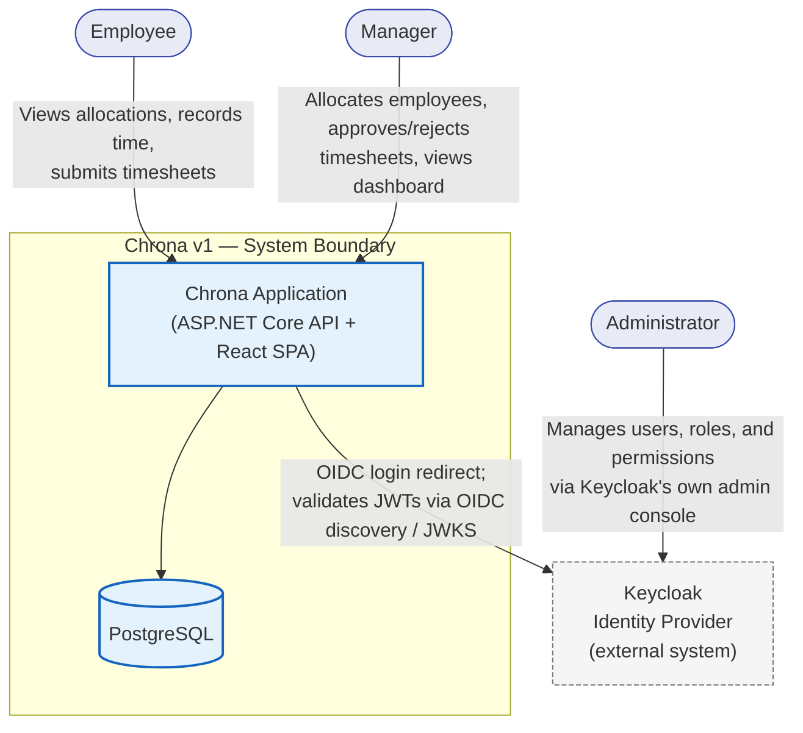

# 02 — System Context

**Document ID:** SYS-002
**Status:** Draft — pending review
**Version:** 1.0.0

---

## 1. Purpose

A system context diagram draws exactly one boundary: Chrona as a single box, and everything that sits outside it — the people who use it and the other systems it depends on. This document defines that boundary precisely, so later documents (module design, component diagram, deployment diagram) can decompose the inside without re-litigating what "inside" means.

---

## 2. System Context Diagram

A note on notation: this uses a standard Mermaid flowchart rather than Mermaid's `C4Context` syntax. `C4Context` renders less reliably across GitHub, VS Code, and plain markdown viewers as of mid-2026 — for a document meant to be read without a specific toolchain, the flowchart form is the safer choice, styled to carry the same meaning (actor / internal system / external system).

---

## 3. Actors

### Employee

An employee of the organization operating this Chrona instance. Interacts with Chrona directly, through the browser-based frontend, after authenticating via Keycloak.

- Views their own current and upcoming allocations.
- Records time entries against an active allocation.
- Submits a timesheet for a reporting period.

An Employee has no access to any other employee's data, and no access to allocation, project, or approval actions beyond their own timesheets.

### Manager

An employee with allocation and approval authority over a set of projects or people. Interacts with Chrona through the same frontend as an Employee, with a wider set of permissions granted through their Keycloak role.

- Allocates employees to projects and sets allocation periods.
- Reviews submitted timesheets and approves or rejects them.
- Views the dashboard: utilization, pending approvals, planned vs. actual hours, active projects.

A Manager does not manage user accounts, roles, or permissions — that is the Administrator's responsibility, performed outside Chrona entirely.

### Administrator

Responsible for who can access the system and what they can do once inside. In v1, the Administrator does not use a Chrona-built interface for this at all — there isn't one. User accounts, roles, and permissions are managed directly in Keycloak's own admin console.

This is a deliberate v1 simplification: building and maintaining a custom user-management UI would duplicate functionality Keycloak already provides, for a capability that isn't part of Chrona's core business value (Work Allocation). It is recorded here explicitly so no later document accidentally assumes an admin screen exists inside Chrona.

---

## 4. External Systems

### Keycloak — Identity Provider

The only external system in Chrona v1. "External" here means a separately deployed system with its own protocol boundary and its own datastore — not a third-party SaaS dependency; Keycloak runs in the same Docker Compose stack as Chrona, but Chrona's application code never touches its internals directly.

Chrona depends on Keycloak for:

- **Authentication** — the OIDC Authorization Code flow. A user is redirected to Keycloak to log in, and Keycloak redirects back with an authorization code that Chrona exchanges for tokens.
- **Token validation** — every authenticated API call presents a JWT access token, which Chrona validates against Keycloak's OIDC discovery document and JWKS endpoint (signature, issuer, audience, expiry).
- **User and role management** — performed entirely by the Administrator inside Keycloak, not inside Chrona.

No other external system exists in v1. There is no payroll integration, no calendar sync, no messaging platform integration, and no third-party API dependency of any kind. If this changes, it changes this document first.

---

## 5. System Boundary

**Inside the boundary** (deployed and operated as one unit, via Docker Compose):

- The Chrona application: the ASP.NET Core API (all six modules) and the React frontend.
- The Chrona PostgreSQL database — Chrona's own data, not shared with any other system.

**Outside the boundary:**

- Keycloak and its own database — a separate deployable with its own lifecycle, even though it runs alongside Chrona in the same Compose stack.
- The actors' own browsers and devices — the mechanism through which people reach Chrona, not part of the system itself.

**Boundary-crossing interactions** are exactly the four arrows in the diagram above: Employee → Chrona, Manager → Chrona, Administrator → Keycloak, and Chrona → Keycloak. Everything else — module-to-module calls inside the API, the API's queries against its own database — is internal, and belongs in `03-module-design.md` and `12-component-diagram.md`, not here.

---

## 6. Known Conflict With Existing ADRs (noted, not resolved)

`ADR-003` (Keycloak) was written under the enterprise-vision multi-tenant scope and describes one Keycloak Realm per Tenant. v1 has no tenant concept — this document assumes a single realm. Noted here per your instruction and left for the architecture cleanup after the system design package is complete; it does not block this document or the ones that follow it.