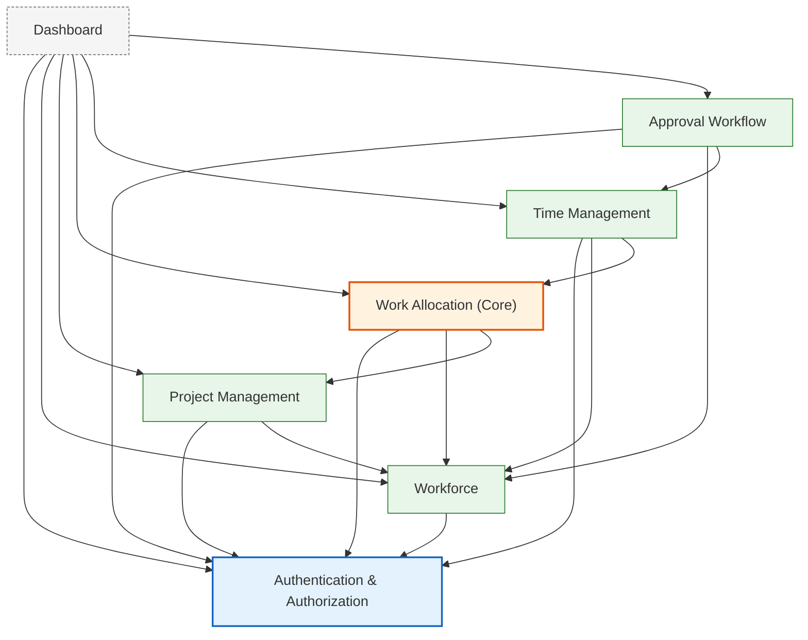

# 03 — Module Design

**Document ID:** SYS-003
**Status:** Draft — pending review
**Version:** 1.0.0

---

## 1. Purpose

Chrona is not one problem, it's several related ones with different rates of change and different sources of truth: who works here (Workforce), what work exists (Project Management), how work is planned (Work Allocation), what actually happened (Time Management), whether that's accepted (Approval Workflow), and whether any of this is visible to the people who need to see it (Dashboard). Collapsing these into one undifferentiated service would mean every change to "who's on a project" risks touching the code that validates capacity, which risks touching the code that decides whether a timesheet is approved. Splitting them into modules with an explicit, enforced dependency direction means a change to Workforce cannot silently break Approval Workflow's logic — the only way it can affect it at all is through the narrow, stable contract Workforce chooses to expose.

Work Allocation is the core domain because it is the one decision the rest of the system exists to support, validate, or report on. Authentication, Workforce, and Project Management exist to make an allocation decision possible in the first place — who can be allocated, to what. Time Management, Approval Workflow, and Dashboard exist to record, validate, and report on the consequences of that decision once it's made. If Work Allocation stopped working, nothing else in the system would have anything meaningful left to do; if Dashboard stopped working, everything else would keep functioning. That asymmetry is what "core domain" means here, and it's the reason Work Allocation's business rules are protected more carefully than any other module's in Section 6.

---

## 2. Module Dependency Diagram

An arrow means "depends on" — it points from the module that needs something toward the module that provides it. Read that way, the graph has four bands: **Authentication & Authorization** at the foundation (needed by everyone, needs nothing internal); **Workforce** just above it; **Project Management** and **Work Allocation** building on those; **Time Management** and **Approval Workflow** building on Work Allocation; and **Dashboard** on top, depending on everything and depended on by nothing.

Every edge, explained:

- **Workforce → Auth**: needs the current principal's identity to authorize employee/department changes, and to resolve "which Employee is the logged-in user."
- **Project Management → Auth**: same reason — only a Manager may create or modify a Project.
- **Project Management → Workforce**: adding a Project Member requires confirming the `EmployeeId` is real.
- **Work Allocation → Auth**: authorizing who may allocate, and recording who did.
- **Work Allocation → Workforce**: confirming the `EmployeeId` being allocated exists; resolving "my own allocations" for an Employee's self-service view.
- **Work Allocation → Project Management**: confirming the `ProjectId` exists and the project is active — an allocation against an archived or nonexistent project is meaningless.
- **Time Management → Auth**: authorizing the request and identifying whose time entry this is.
- **Time Management → Workforce**: resolving the current principal to an `EmployeeId` when a new timesheet or time entry is created.
- **Time Management → Work Allocation**: "an employee cannot log time outside an active allocation" — every time entry is validated against a real, active allocation before it's recorded.
- **Approval Workflow → Auth**: identifying which Manager is approving.
- **Approval Workflow → Workforce**: confirming the approving Manager actually has authority over the timesheet's owning Employee — and, as the direct corollary, that a Manager isn't approving their own timesheet.
- **Approval Workflow → Time Management**: approving or rejecting changes a Timesheet's status; Time Management owns that data and that transition, so Approval Workflow asks rather than writing to it directly.
- **Dashboard → all six others**: every number on the dashboard belongs to some other module. Dashboard never computes or stores it independently.

Two asymmetries are deliberate, not omissions: **nothing depends on Dashboard** (it is a pure consumer, never a provider), and **Authentication & Authorization depends on nothing internal** (it is the one module every other module may assume exists and is stable). Authentication & Authorization is also different in *kind* from the other six — it holds no business data and models no business process. It behaves less like a bounded context and more like shared infrastructure that every bounded context is allowed to depend on without that being considered coupling. Section 3 makes this distinction explicit.

---

## 3. Module Responsibilities

### Authentication & Authorization

- **Purpose:** establish who is making a request and what they may do, by validating tokens issued by Keycloak.
- **Responsibilities:** validate incoming JWT access tokens (signature, issuer, audience, expiry) against Keycloak's OIDC discovery document and JWKS; extract the current principal's subject ID, username, and roles; enforce coarse, role-based authorization at the API boundary.
- **Data it owns:** none. No table in the Chrona database belongs to this module.
- **Public capabilities exposed to other modules:** `ICurrentUserContext` — the current principal's subject ID, username, and roles, for the lifetime of the current request.
- **What it must never do:** store or reason about business data; resolve "which Employee is this" itself (that belongs to Workforce); perform fine-grained, business-rule-dependent authorization such as "can this Manager approve this Employee's timesheet" (that belongs to the module owning the rule).

### Workforce

- **Purpose:** be the single source of truth for who works at the organization and how they're organized.
- **Responsibilities:** maintain Employee and Department records; maintain the mapping from an authenticated principal to an Employee; maintain manager/employee reporting relationships sufficient to answer "does Manager X have authority over Employee Y."
- **Data it owns:** Employee, Department.
- **Public capabilities exposed to other modules:** `EmployeeExists(employeeId)`, `GetEmployeeForPrincipal(subjectId)`, `IsManagerOf(managerId, employeeId)`, and read-only employee/department lookups (name, department) for display purposes.
- **What it must never do:** allocate work, record time, or approve anything; expose its `DbContext` or entity types to another module — only the capabilities above.

### Project Management

- **Purpose:** own the existence and membership of Projects, independent of how work is allocated against them.
- **Responsibilities:** create, update, and archive Projects; maintain Project Membership; answer whether a Project currently exists and is active.
- **Data it owns:** Project, ProjectMember.
- **Public capabilities exposed to other modules:** `ProjectExistsAndIsActive(projectId)`, read-only project lookups (name, status) for display purposes.
- **What it must never do:** allocate employees to a project — that is Work Allocation's decision; validate capacity; touch Timesheets or Approvals.

### Work Allocation *(Core Domain)*

- **Purpose:** the system's central business decision — reserving an Employee's capacity against a Project for a period of time.
- **Responsibilities:** create, update, and manage the lifecycle of an Allocation; validate that an allocation does not exceed an Employee's capacity; validate that the referenced Employee exists and the referenced Project exists and is active before allowing an allocation.
- **Data it owns:** Allocation, and the value objects describing it (allocation period, capacity, status).
- **Public capabilities exposed to other modules:** `AllocationExistsAndIsActive(allocationId)` (used by Time Management), read-only allocation lookups for Dashboard.
- **What it must never do:** record actual time worked (that's Time Management's data); approve or reject anything; modify Employee or Project data — it only references their IDs.

### Time Management

- **Purpose:** capture what employees actually did, against what was planned.
- **Responsibilities:** maintain Timesheets and the Time Entries within them; validate that every Time Entry corresponds to a real, active Allocation for the Employee recording it; track a Timesheet's status up to submission.
- **Data it owns:** Timesheet, TimeEntry.
- **Public capabilities exposed to other modules:** `MarkTimesheetApproved(timesheetId)`, `MarkTimesheetRejected(timesheetId, reason)` (called by Approval Workflow), read-only timesheet/time-entry lookups for Dashboard.
- **What it must never do:** decide whether a timesheet is approved — it only records the outcome once Approval Workflow decides; modify an Allocation.

### Approval Workflow

- **Purpose:** make the business decision of whether submitted work is accepted.
- **Responsibilities:** validate that the approving Manager has authority over the Employee who owns the timesheet; enforce that a Manager cannot approve their own timesheet; record the decision and instruct Time Management to update the Timesheet's status.
- **Data it owns:** the approval decision and its history — who approved or rejected, when, and why (for rejections). Not the Timesheet itself.
- **Public capabilities exposed to other modules:** read-only lookups of pending/approved/rejected counts for Dashboard.
- **What it must never do:** change a Timesheet's content (only its status, and only by asking Time Management); allocate work; maintain its own copy of the manager/employee relationship — it asks Workforce.

### Dashboard

- **Purpose:** give a Manager a single, read-only view across everything else in the system.
- **Responsibilities:** aggregate and present utilization, pending approvals, planned vs. actual hours, and active projects.
- **Data it owns:** none. Every number is a query against another module's public read capabilities.
- **Public capabilities exposed to other modules:** none. Nothing in the system needs data from Dashboard.
- **What it must never do:** own business data; write to any other module; become the place business logic accidentally gets implemented because it's convenient to compute there — recurring calculations belong in the module that owns the underlying data, exposed as a read capability, not reimplemented inside Dashboard.

---

## 4. Module Boundaries

**What belongs inside every module, without exception:** its own aggregates, entities, value objects, domain services, and the EF Core configuration and migrations for the tables it owns.

**What belongs outside every module, without exception:** any other module's tables, entities, or `DbContext`. A module may hold another module's identifier (`EmployeeId`, `ProjectId`, and so on) as a plain value — never that module's data.

| Module | May be called by | Interaction type | May call |
|---|---|---|---|
| Authentication & Authorization | All six other modules | Query (current-user context) | Nothing internal (Keycloak only, per `02-system-context.md`) |
| Workforce | Project Management, Work Allocation, Time Management, Approval Workflow, Dashboard | Query | Authentication & Authorization |
| Project Management | Work Allocation, Dashboard | Query | Authentication & Authorization, Workforce |
| Work Allocation | Time Management, Dashboard | Query | Authentication & Authorization, Workforce, Project Management |
| Time Management | Approval Workflow, Dashboard | Query + Command (`MarkTimesheetApproved` / `MarkTimesheetRejected`) | Authentication & Authorization, Workforce, Work Allocation |
| Approval Workflow | Dashboard | Query | Authentication & Authorization, Workforce, Time Management (command) |
| Dashboard | Nothing | — | All six other modules (query only) |

Almost every interaction in this system is a **query** — read data, no side effects, safe to call as often as needed. There is exactly one **command** that crosses a module boundary: Approval Workflow instructing Time Management to mark a Timesheet approved or rejected. Every other cross-module call answers a question; only that one changes something outside the caller's own module, and it does so by asking the owning module to make the change, never by reaching past it.

---

## 5. Cross-Module Communication

**Call another module directly — the default.** When a module needs an answer right now to complete its own operation and can't proceed without it: validating a Project exists before allocating, validating an active Allocation before recording time, checking manager authority before approving. This is a plain, synchronous, in-process call against the target module's exposed contract. In a modular monolith there's no network between modules, no partial failure, no eventual consistency to reason about — so this is the simple, correct default, not a shortcut.

**Expose an application service.** The other half of "call another module": every module callable by others exposes its callable surface as an interface in its `Contracts` folder (`IWorkforceQueries`, `IProjectLookup`, and so on), never as a direct reference to its own internal command or query handlers. This is what lets a module's internals change without breaking whoever calls it.

**Publish a domain event — the exception, not the default.** Reserved for when a module finishes something and other modules might want to react, without the first module needing to know who, or wait for the reaction. One clearly justified case in this design: if an Employee is ever deactivated in Workforce, Work Allocation should react by ending their future allocations. `EmployeeDeactivated`, published by Workforce and handled by Work Allocation, is the right shape — Workforce doesn't need a response and shouldn't need to know Work Allocation exists to do its own job. A tempting but *not* justified case: having Time Management publish `TimesheetApproved` so Dashboard can refresh. Dashboard queries live in v1; there is no cache to invalidate yet, so an event here would solve a problem the system doesn't have. Revisit if and when Dashboard introduces caching.

**Avoid communication entirely — the default between any two modules not connected in the diagram.** If Dashboard needs a number Time Management already computes, Dashboard queries Time Management — it does not also ask Work Allocation to recompute it, and Time Management never reaches backward into Dashboard for anything. Silence between modules is the norm; every edge in Section 2's diagram is a deliberate, justified exception to it.

**Keep it simple.** No message broker, no outbox pattern, no eventual-consistency handling for v1. A domain event here means an in-process .NET event or mediator notification, handled synchronously within the same request and the same database transaction where practical — not a distributed messaging concern. Guaranteed, transactional cross-module event delivery is exactly the kind of complexity the project's Complexity Budget asks to be justified by real evidence first, not built in advance of needing it.

---

## 6. Dependency Rules

1. Dashboard never owns business data.
2. Time Management cannot modify Allocations.
3. Project Management cannot approve Timesheets.
4. Modules never access another module's persistence directly — no shared tables, no cross-module joins, no direct `DbContext` references.
5. Work Allocation remains the only owner of allocation business rules; capacity validation logic lives nowhere else.
6. Authentication & Authorization never owns or reasons about business data, and never performs fine-grained, business-rule-dependent authorization — identity and coarse role checks only.
7. Workforce is the only owner of the principal-to-Employee mapping and the manager/employee reporting relationship; no other module keeps its own copy.
8. A module may hold another module's identifier as a plain value; it may not cache or duplicate that module's data beyond the identifier without an explicit, named reason recorded in that module's design.
9. Approval Workflow changes a Timesheet's status only by calling Time Management's command — it never writes to the Timesheet table itself.
10. No module may depend on Dashboard.
11. Cross-module calls are synchronous Application Service calls or in-process domain events only — no module introduces its own ad hoc channel (a direct HTTP call to itself, a shared static, a shared cache) to reach another module.

---

## 7. Future Evolution

If Chrona ever grew well beyond a single small deployment, the module boundaries already in place here are exactly the seams a future extraction would use. Work Allocation — the module with the most well-defined `Contracts` surface and the fewest callers reaching past it — would be the most natural first candidate to consider running as its own deployable, communicating with the rest of the system over the same contract it already exposes today, just moved from an in-process call to a network one. This is not a plan; it's an observation that today's boundaries wouldn't need to be redrawn later, only relocated. Nothing about the current design should anticipate it.

---

## 8. Design Decisions

### Decisions made

- Work Allocation is confirmed as the core domain: every other module exists to enable, validate, or report on it.
- Authentication & Authorization is architecturally foundational (depended on by everyone, depends on nothing internal) but functionally thin — identity and coarse authorization only, no business data.
- Workforce owns the principal-to-Employee mapping and the manager/employee reporting relationship; no other module duplicates either.
- All v1 cross-module collaboration is synchronous, in-process Application Service calls, with domain events reserved for genuine fire-and-forget reactions.
- Dashboard is a pure, read-only consumer of every other module; nothing depends on it, and it owns no data of its own.

### Open Questions

- Should `ICurrentUserContext` also expose the resolved `EmployeeId`, or should every module that needs it query Workforce independently, as designed here? This document chose the latter for simplicity; revisit only if identity-resolution calls become a measurable, repeated cost.
- Does Approval Workflow need a general, multi-level reporting hierarchy from Workforce, or is a single manager per employee sufficient for v1? `16-business-rules.md` should settle this before Time Management or Approval Workflow are implemented.
- Should Time Management validate against Work Allocation per time entry, or once per timesheet submission? Affects performance and API shape — belongs in `14-api-design.md` or the domain model, not here.

### Deferred to v2

- Independent service extraction for any module — not needed, not designed, noted only as a possibility in Section 7.
- Any cross-module event bus, outbox pattern, or distributed messaging — v1 stays entirely in-process.
- Multi-tenancy-aware module boundaries — already tracked in ADR-005 and ADR-006, unaffected by this document.