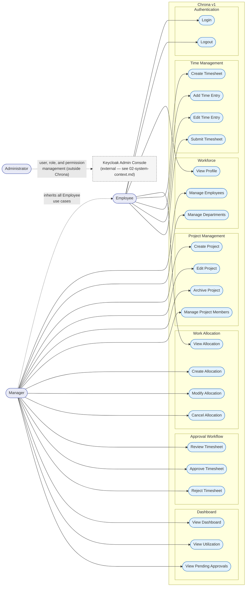

# 04 — Use Cases

**Document ID:** SYS-004
**Status:** Draft — pending review
**Version:** 1.0.0

---

## 1. Purpose

A use case describes one thing a user is trying to accomplish, and the interaction between that user and Chrona that accomplishes it — from the outside. It does not say which module handles the request, what the API endpoint looks like, or how the data is stored; those are implementation, and belong in `03-module-design.md`, `14-api-design.md`, and the documents around them. A use case says: who wants what, what has to be true first, what normally happens, what can go differently, and what's true afterward.

Defining these before implementation matters for a specific reason here, not a general one: `03-module-design.md` already decided *how* the six business modules divide responsibility. This document checks that decision from the outside — does every real thing a user needs to do map onto exactly one module, cleanly, with no use case straddling a boundary that shouldn't be crossed? Where it doesn't (see Section 7), that's worth knowing now, while it's a paragraph to fix, rather than after it's a schema.

---

## 2. System Actors

**Employee**
An employee of the organization. Uses Chrona to see their own allocations, record the time they actually work, and submit that time for approval. Has no visibility into any other Employee's data and no elevated capabilities.

**Manager**
An employee with elevated responsibility: allocating people to projects, administering the Workforce and Project Management data that allocation depends on, and approving or rejecting submitted timesheets. In v1, Manager is a single broad role — it does not distinguish "people who manage projects" from "people who manage employee records" from "people who approve timesheets." Everything an Employee can do for themselves, a Manager can also do — Manager adds capability, it never removes any.

**Administrator**
Responsible for who can access Chrona and what role they hold, managed entirely through Keycloak's own admin console — not through any interface inside Chrona (per `02-system-context.md`). Administrator therefore has **no use case in this document's catalog**; every use case below belongs to Employee or Manager. This is intentional, not an omission, and is worth stating plainly so no later document assumes an in-app admin screen exists.

---

## 3. Use Case Diagram

Mermaid has no native use-case-diagram notation, so this uses a flowchart styled to carry the same meaning: actors on the left, use cases grouped by module inside the system boundary, and a dashed "inherits" edge from Manager to Employee standing in for UML actor generalization — it means every Employee use case is also available to Manager, without redrawing fifteen redundant edges. Administrator's edge deliberately leaves the system boundary entirely, consistent with Section 2.

---

## 4. Use Case Catalog

### Authentication

#### Login

- **Goal:** Establish an authenticated session so the user can access Chrona.
- **Primary Actor:** Employee, Manager
- **Supporting Actors:** None — Keycloak performs the credential check, but per `02-system-context.md` it is an external system, not a Chrona actor.
- **Preconditions:** The user has a valid account in Keycloak.
- **Trigger:** The user opens Chrona while unauthenticated.
- **Main Success Scenario:**
  1. The user navigates to Chrona.
  2. Chrona redirects the user to Keycloak (OIDC Authorization Code flow).
  3. The user enters their credentials at Keycloak.
  4. Keycloak redirects back to Chrona with an authorization code.
  5. Chrona exchanges the code for tokens and establishes the session.
  6. The user is presented with the interface appropriate to their role.
- **Alternative Flows:**
  - Invalid credentials: Keycloak rejects the login; the user remains at Keycloak's login screen and may retry.
  - Expired or invalid authorization code: Chrona rejects the callback and restarts the flow from step 2.
- **Postconditions:** The user holds a valid session with an access token Chrona can validate on subsequent requests.

#### Logout

- **Goal:** End the current authenticated session.
- **Primary Actor:** Employee, Manager
- **Supporting Actors:** None.
- **Preconditions:** The user is currently authenticated.
- **Trigger:** The user chooses to log out.
- **Main Success Scenario:**
  1. The user requests logout.
  2. Chrona clears the local session.
  3. Chrona redirects to Keycloak's end-session endpoint to invalidate the token at the identity provider.
  4. The user is returned to an unauthenticated landing state.
- **Alternative Flows:**
  - Session already expired: Chrona clears local state and redirects to login directly, skipping the end-session round trip.
- **Postconditions:** No valid session remains; a subsequent request requires Login again.

### Workforce

#### View Profile

- **Goal:** Let a user see their own employee information.
- **Primary Actor:** Employee, Manager
- **Supporting Actors:** None.
- **Preconditions:** The user is authenticated and resolves to an Employee record (Workforce's `GetEmployeeForPrincipal`, per `03-module-design.md`).
- **Trigger:** The user opens their profile view.
- **Main Success Scenario:**
  1. The user requests their profile.
  2. Chrona resolves the current principal to an Employee record via Workforce.
  3. Chrona displays name, department, and reporting manager.
- **Alternative Flows:**
  - No Employee record exists for the current principal: Chrona shows a clear error rather than an empty or misleading profile — this indicates an account provisioning gap, not a normal outcome.
- **Postconditions:** None — read-only.

#### Manage Employees

- **Goal:** Maintain accurate employee records.
- **Primary Actor:** Manager
- **Supporting Actors:** None.
- **Preconditions:** The requesting user holds the Manager role.
- **Trigger:** A Manager needs to add, update, or deactivate an employee record.
- **Main Success Scenario:**
  1. The Manager opens employee management.
  2. The Manager creates a new Employee, or edits an existing one (name, department, reporting manager).
  3. Workforce validates the input and persists the change.
  4. If an Employee is deactivated, Workforce publishes `EmployeeDeactivated` so Work Allocation can end their future allocations (per `03-module-design.md`, Section 5).
- **Alternative Flows:**
  - Assigning a nonexistent Department: rejected with a validation error.
  - Deactivating an Employee with active allocations: allowed — deactivation is what triggers ending them, not an operation blocked by their existence.
- **Postconditions:** The Employee record reflects the change; if deactivated, any future allocations for that Employee are being ended.

#### Manage Departments

- **Goal:** Maintain the set of departments employees can belong to.
- **Primary Actor:** Manager
- **Supporting Actors:** None.
- **Preconditions:** The requesting user holds the Manager role.
- **Trigger:** A Manager needs to add, rename, or remove a department.
- **Main Success Scenario:**
  1. The Manager opens department management.
  2. The Manager creates, renames, or removes a Department.
  3. Workforce validates and persists the change.
- **Alternative Flows:**
  - Removing a Department that still has Employees assigned: rejected until those Employees are reassigned.
- **Postconditions:** The Department list reflects the change.

### Project Management

#### Create Project

- **Goal:** Establish a new Project that work can later be allocated against.
- **Primary Actor:** Manager
- **Supporting Actors:** None.
- **Preconditions:** The requesting user holds the Manager role.
- **Trigger:** A Manager needs to start tracking a new piece of work.
- **Main Success Scenario:**
  1. The Manager submits a new Project's name and details.
  2. Project Management validates and creates the Project in an active state.
- **Alternative Flows:**
  - Duplicate or invalid project name: rejected with a validation error.
- **Postconditions:** The Project exists and is active, and can be referenced by Work Allocation.

#### Edit Project

- **Goal:** Update a Project's details.
- **Primary Actor:** Manager
- **Supporting Actors:** None.
- **Preconditions:** The Project exists.
- **Trigger:** A Manager needs to correct or update Project information.
- **Main Success Scenario:**
  1. The Manager opens an existing Project.
  2. The Manager updates its details.
  3. Project Management validates and persists the change.
- **Alternative Flows:**
  - Editing an archived Project: rejected in v1 — see Open Questions regarding reactivation.
- **Postconditions:** The Project reflects the updated details.

#### Archive Project

- **Goal:** Retire a Project that no longer has active work.
- **Primary Actor:** Manager
- **Supporting Actors:** None.
- **Preconditions:** The Project exists and is active.
- **Trigger:** A Manager determines the Project is finished.
- **Main Success Scenario:**
  1. The Manager archives the Project.
  2. Project Management marks it inactive.
  3. `ProjectExistsAndIsActive` now returns false for this Project, so Work Allocation refuses any *new* allocation against it.
- **Alternative Flows:**
  - Archiving a Project with open Allocations: allowed in v1 — archiving affects new allocations only; it does not retroactively cancel existing ones (flagged in Open Questions).
- **Postconditions:** The Project is inactive; no new Allocation may reference it.

#### Manage Project Members

- **Goal:** Maintain which Employees are associated with a Project.
- **Primary Actor:** Manager
- **Supporting Actors:** Workforce (validates the Employee exists, per `03-module-design.md`).
- **Preconditions:** The Project exists; the Employee being added exists in Workforce.
- **Trigger:** A Manager needs to add or remove someone from a Project's membership.
- **Main Success Scenario:**
  1. The Manager selects an Employee to add to, or remove from, a Project.
  2. Project Management confirms the Employee exists via Workforce.
  3. Project Management updates the membership.
- **Alternative Flows:**
  - The Employee does not exist, or is deactivated: rejected with a validation error.
- **Postconditions:** The Project's membership list reflects the change. This does not by itself allocate any of the Employee's capacity — see Create Allocation.

### Work Allocation

#### Create Allocation

- **Goal:** Reserve an Employee's capacity against a Project for a period.
- **Primary Actor:** Manager
- **Supporting Actors:** Workforce (validates the Employee), Project Management (validates the Project is active).
- **Preconditions:** The Employee exists; the Project exists and is active.
- **Trigger:** A Manager needs to plan who works on what, and for how long.
- **Main Success Scenario:**
  1. The Manager selects an Employee, a Project, and a period.
  2. Work Allocation confirms the Employee exists (Workforce) and the Project exists and is active (Project Management).
  3. Work Allocation validates that the new allocation does not exceed the Employee's capacity for that period.
  4. Work Allocation creates the Allocation in an active state.
- **Alternative Flows:**
  - The Employee's capacity would be exceeded: rejected; the Manager must adjust the period, the amount, or an existing allocation first.
  - The Project is archived or does not exist: rejected.
  - The Employee does not exist or is deactivated: rejected.
- **Postconditions:** An active Allocation exists, available for Time Management to validate time entries against.

#### Modify Allocation

- **Goal:** Change an existing Allocation's period or amount.
- **Primary Actor:** Manager
- **Supporting Actors:** None beyond those already validated at creation.
- **Preconditions:** The Allocation exists and is active.
- **Trigger:** Plans changed after the Allocation was created.
- **Main Success Scenario:**
  1. The Manager updates the Allocation's period or amount.
  2. Work Allocation re-validates capacity for the new values.
  3. Work Allocation persists the change and records it in the Allocation's history.
- **Alternative Flows:**
  - The new values would exceed capacity: rejected.
  - Existing Time Entries fall outside the new period: flagged, not yet resolved — see Open Questions.
- **Postconditions:** The Allocation reflects the updated period or amount.

#### Cancel Allocation

- **Goal:** End an Allocation before its period completes.
- **Primary Actor:** Manager
- **Supporting Actors:** None.
- **Preconditions:** The Allocation exists and is active.
- **Trigger:** The work is no longer needed, or the Employee is being reassigned.
- **Main Success Scenario:**
  1. The Manager cancels the Allocation.
  2. Work Allocation transitions it to a cancelled state and records the transition in its history.
- **Alternative Flows:**
  - The Allocation already has recorded Time Entries: cancellation proceeds; existing entries remain, but no further time may be recorded against it.
- **Postconditions:** The Allocation is cancelled; Time Management refuses new Time Entries against it.

#### View Allocation

- **Goal:** See an Allocation's details.
- **Primary Actor:** Employee, Manager
- **Supporting Actors:** None.
- **Preconditions:** None beyond authentication.
- **Trigger:** A user wants to see what's allocated.
- **Main Success Scenario:**
  1. The user requests Allocation details.
  2. Work Allocation returns them, scoped to what the requester may see: an Employee sees only their own; a Manager sees allocations within their scope.
- **Alternative Flows:**
  - The requested Allocation is outside the user's scope: refused.
- **Postconditions:** None — read-only.

### Time Management

#### Create Timesheet

- **Goal:** Open a new reporting period's timesheet.
- **Primary Actor:** Employee
- **Supporting Actors:** None.
- **Preconditions:** None beyond authentication — a Timesheet is a container for a period; it does not itself require an existing Allocation (individual Time Entries do).
- **Trigger:** A new reporting period begins, or the Employee chooses to start logging time for one.
- **Main Success Scenario:**
  1. The Employee opens a new Timesheet for a reporting period.
  2. Time Management creates it in a draft state.
- **Alternative Flows:**
  - A Timesheet already exists for that Employee and period: the existing one is reused rather than duplicated.
- **Postconditions:** A draft Timesheet exists for the period, ready to receive Time Entries.

#### Add Time Entry

- **Goal:** Record time worked against a specific Allocation.
- **Primary Actor:** Employee
- **Supporting Actors:** Work Allocation (validates the Allocation is real and active, per `03-module-design.md`).
- **Preconditions:** A draft Timesheet exists for the period; the referenced Allocation exists and is active.
- **Trigger:** The Employee has worked time to record.
- **Main Success Scenario:**
  1. The Employee selects an Allocation and enters hours worked on a date.
  2. Time Management confirms the Allocation exists and is active via Work Allocation.
  3. Time Management adds the Time Entry to the draft Timesheet.
- **Alternative Flows:**
  - The Allocation is not active (ended, cancelled, or never existed): rejected — this is the enforcement point for "an employee cannot log time outside an active allocation."
  - The Timesheet is not in draft state: rejected.
- **Postconditions:** The Time Entry is recorded against the draft Timesheet.

#### Edit Time Entry

- **Goal:** Correct a previously recorded Time Entry.
- **Primary Actor:** Employee
- **Supporting Actors:** None.
- **Preconditions:** The Time Entry exists, on a Timesheet still in draft state.
- **Trigger:** The Employee notices an error before submitting.
- **Main Success Scenario:**
  1. The Employee updates the hours or date on a Time Entry.
  2. Time Management persists the change.
- **Alternative Flows:**
  - The Timesheet has already been submitted: rejected. An approved Timesheet is immutable by design; a rejected one must be reopened (see Reject Timesheet) before entries can be edited again.
- **Postconditions:** The Time Entry reflects the correction.

#### Submit Timesheet

- **Goal:** Close a Timesheet for approval.
- **Primary Actor:** Employee
- **Supporting Actors:** None.
- **Preconditions:** The Timesheet is in draft state and contains at least one Time Entry.
- **Trigger:** The reporting period has ended, or the Employee is otherwise ready for review.
- **Main Success Scenario:**
  1. The Employee submits the Timesheet.
  2. Time Management transitions it to a submitted state, closing it to further edits.
  3. The submission becomes visible to Approval Workflow.
- **Alternative Flows:**
  - The Timesheet has no Time Entries: rejected — an empty Timesheet cannot be submitted.
- **Postconditions:** The Timesheet is submitted and read-only until a Manager acts on it.

### Approval Workflow

#### Review Timesheet

- **Goal:** Examine a submitted Timesheet before deciding on it.
- **Primary Actor:** Manager
- **Supporting Actors:** Workforce (confirms the Manager has authority over this Employee).
- **Preconditions:** The Timesheet is submitted; the requesting Manager has authority over the owning Employee.
- **Trigger:** A Timesheet is waiting for a decision.
- **Main Success Scenario:**
  1. The Manager opens a submitted Timesheet.
  2. Approval Workflow confirms the Manager's authority over the Employee via Workforce.
  3. The Timesheet's Time Entries are displayed for review.
- **Alternative Flows:**
  - The Manager has no authority over this Employee: refused.
- **Postconditions:** None — read-only. Review does not by itself change the Timesheet's status.

#### Approve Timesheet

- **Goal:** Accept a submitted Timesheet as correct.
- **Primary Actor:** Manager
- **Supporting Actors:** Workforce (authority check), Time Management (status change).
- **Preconditions:** The Timesheet is submitted; the Manager has authority over the Employee; the Manager is not the Timesheet's owner.
- **Trigger:** The Manager has reviewed the Timesheet and finds it correct.
- **Main Success Scenario:**
  1. The Manager approves the Timesheet.
  2. Approval Workflow confirms authority and that the Manager isn't approving their own Timesheet.
  3. Approval Workflow records the decision and calls Time Management's `MarkTimesheetApproved`.
  4. Time Management transitions the Timesheet to approved and immutable.
- **Alternative Flows:**
  - The Manager is the Timesheet's owner: rejected outright — a Manager cannot approve their own timesheet.
  - The Manager has no authority over the Employee: rejected.
- **Postconditions:** The Timesheet is approved and immutable.

#### Reject Timesheet

- **Goal:** Send a submitted Timesheet back for correction.
- **Primary Actor:** Manager
- **Supporting Actors:** Workforce (authority check), Time Management (status change).
- **Preconditions:** The Timesheet is submitted; the Manager has authority over the Employee.
- **Trigger:** The Manager finds an error in the submission.
- **Main Success Scenario:**
  1. The Manager rejects the Timesheet with a reason.
  2. Approval Workflow confirms authority.
  3. Approval Workflow records the decision, including the reason, and calls Time Management's `MarkTimesheetRejected`.
  4. Time Management reopens the Timesheet to draft state so the Employee can correct it.
- **Alternative Flows:**
  - No reason is provided: rejected — a rejection reason is mandatory so the Employee knows what to correct.
- **Postconditions:** The Timesheet is back in draft state; the Employee can Edit Time Entries and Submit again.

### Dashboard

#### View Dashboard

- **Goal:** Give a Manager a single overview of what's happening across their scope.
- **Primary Actor:** Manager
- **Supporting Actors:** Workforce, Project Management, Work Allocation, Time Management, Approval Workflow — all queried, read-only (per `03-module-design.md`).
- **Preconditions:** None beyond authentication as a Manager.
- **Trigger:** The Manager opens the dashboard.
- **Main Success Scenario:**
  1. The Manager opens the dashboard.
  2. Dashboard queries each of the five other business modules for figures within the Manager's scope.
  3. Dashboard presents an overview: active projects, current utilization, and pending approvals.
- **Alternative Flows:**
  - One of the underlying modules is unavailable: the affected panel shows a clear "unavailable" state rather than a stale or incorrect number.
- **Postconditions:** None — read-only.

#### View Utilization

- **Goal:** See how fully employees are allocated against their capacity, and how planned hours compare to actual recorded hours.
- **Primary Actor:** Manager
- **Supporting Actors:** Workforce, Work Allocation, Time Management.
- **Preconditions:** None beyond authentication as a Manager.
- **Trigger:** The Manager wants utilization detail beyond the dashboard summary.
- **Main Success Scenario:**
  1. The Manager opens the utilization view.
  2. Dashboard queries Work Allocation for planned capacity and Time Management for actual recorded hours, per Employee, within the Manager's scope.
  3. Dashboard presents planned vs. actual hours per Employee.
- **Alternative Flows:**
  - An Employee has no allocations in the period: shown as zero utilization, not omitted.
- **Postconditions:** None — read-only.

#### View Pending Approvals

- **Goal:** See every Timesheet waiting for a decision.
- **Primary Actor:** Manager
- **Supporting Actors:** Time Management, Approval Workflow.
- **Preconditions:** None beyond authentication as a Manager.
- **Trigger:** The Manager wants to clear their approval queue.
- **Main Success Scenario:**
  1. The Manager opens pending approvals.
  2. Dashboard queries Time Management for submitted Timesheets within the Manager's authority, filtered to those without a recorded decision.
  3. Dashboard presents the list, each item linking to Review Timesheet.
- **Alternative Flows:**
  - No Timesheets are pending: an empty state is shown, not an error.
- **Postconditions:** None — read-only.

---

## 5. Permission Matrix

| Use Case | Employee | Manager | Administrator |
|---|---|---|---|
| Login | ✓ | ✓ | — |
| Logout | ✓ | ✓ | — |
| View Profile | ✓ | ✓ | — |
| Manage Employees | — | ✓ | — |
| Manage Departments | — | ✓ | — |
| Create Project | — | ✓ | — |
| Edit Project | — | ✓ | — |
| Archive Project | — | ✓ | — |
| Manage Project Members | — | ✓ | — |
| Create Allocation | — | ✓ | — |
| Modify Allocation | — | ✓ | — |
| Cancel Allocation | — | ✓ | — |
| View Allocation | ✓ | ✓ | — |
| Create Timesheet | ✓ | ✓ | — |
| Add Time Entry | ✓ | ✓ | — |
| Edit Time Entry | ✓ | ✓ | — |
| Submit Timesheet | ✓ | ✓ | — |
| Review Timesheet | — | ✓ | — |
| Approve Timesheet | — | ✓ | — |
| Reject Timesheet | — | ✓ | — |
| View Dashboard | — | ✓ | — |
| View Utilization | — | ✓ | — |
| View Pending Approvals | — | ✓ | — |

Administrator's column is entirely "—" by design, not by omission — see Section 2.

---

## 6. Functional Requirements Traceability

| Use Case | Responsible Module |
|---|---|
| Login | Authentication & Authorization |
| Logout | Authentication & Authorization |
| View Profile | Workforce |
| Manage Employees | Workforce |
| Manage Departments | Workforce |
| Create Project | Project Management |
| Edit Project | Project Management |
| Archive Project | Project Management |
| Manage Project Members | Project Management |
| Create Allocation | Work Allocation |
| Modify Allocation | Work Allocation |
| Cancel Allocation | Work Allocation |
| View Allocation | Work Allocation |
| Create Timesheet | Time Management |
| Add Time Entry | Time Management |
| Edit Time Entry | Time Management |
| Submit Timesheet | Time Management |
| Review Timesheet | Approval Workflow |
| Approve Timesheet | Approval Workflow |
| Reject Timesheet | Approval Workflow |
| View Dashboard | Dashboard |
| View Utilization | Dashboard |
| View Pending Approvals | Dashboard |

Every use case maps to exactly one responsible module, with no orphans and no use case split across two owners — a direct check on `03-module-design.md`'s boundaries holding up from the user's side.

---

## 7. Design Decisions

### Decisions made

- Administrator has no use case inside Chrona in v1; all user/role/permission management happens directly in Keycloak, per `02-system-context.md`. This catalog belongs entirely to Employee and Manager.
- Manager is a single, broad v1 role that inherits every Employee use case and adds allocation, workforce/project administration, approval, and dashboard capabilities on top. v1 does not introduce a separate HR/administrative persona distinct from Manager.
- Review Timesheet is a distinct, read-only use case from Approve/Reject Timesheet — reviewing never changes status by itself.
- View Dashboard, View Utilization, and View Pending Approvals are three related but separate use cases, all read-only queries against other modules, matching `03-module-design.md`'s Dashboard responsibilities exactly.

### Open Questions

- Should Manage Employees/Departments require a distinct permission from Create Allocation/Approve Timesheet, even though v1 treats all of Manager as one role? Splitting these is exactly the kind of refinement a real Keycloak role/scope model could support later without changing this catalog.
- What happens to a Timesheet's existing Time Entries if the Allocation they reference is later modified so the entries fall outside its new period? Not resolved here — belongs in `16-business-rules.md`.
- Can an archived Project be reactivated, or is archiving permanent in v1? Assumed permanent for now; revisit only if a real workflow need for reactivation appears.

### Deferred to v2

- Any Administrator-facing use case inside Chrona itself (an in-app user directory or role-assignment screen) — v1 relies entirely on Keycloak's own console.
- Splitting "Manager" into more granular roles (e.g., Project Manager vs. People Manager vs. Approver) if the single broad role proves too coarse in practice.
- Retroactive effects of Allocation changes on already-recorded Time Entries — noted as an Open Question above, deferred rather than designed now.