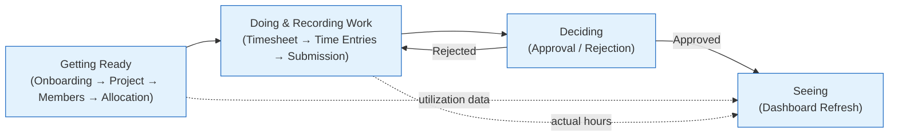
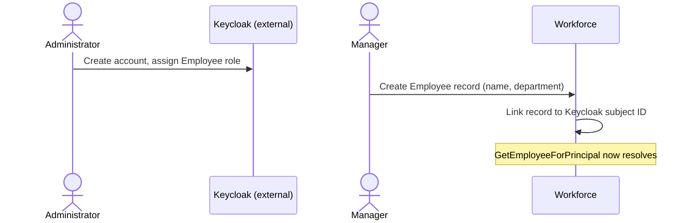
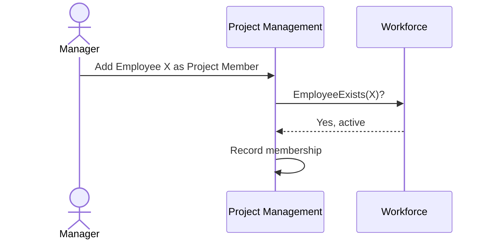
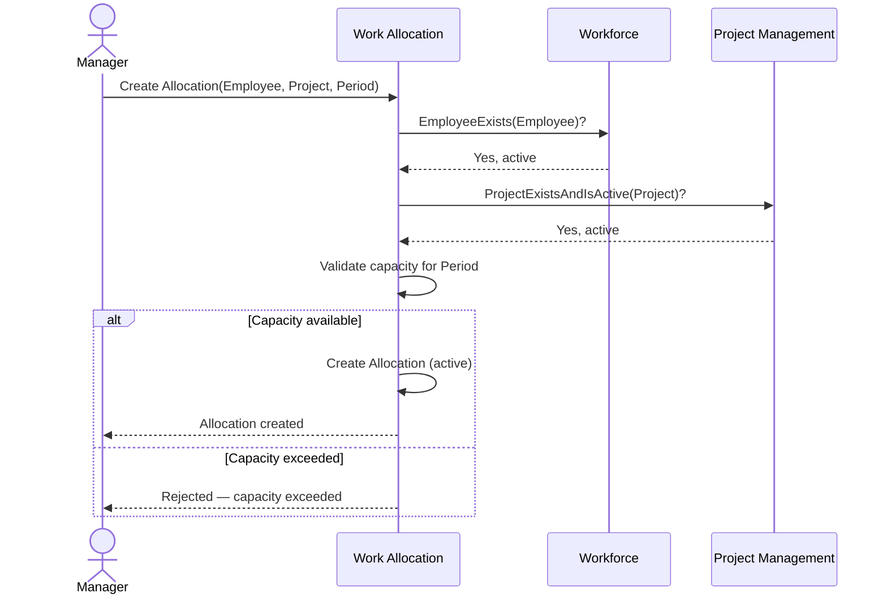

# 05 — Business Processes

**Document ID:** SYS-005
**Status:** Draft — pending review
**Version:** 1.0.0

---

## 1. Purpose

A use case (`04-use-cases.md`) is one actor's interaction with the system, evaluated in isolation — "Approve Timesheet" describes what happens when a Manager approves, full stop. But no timesheet gets approved without first being created, filled in, and submitted, and a rejection sends it back to a step the use case catalog already covered without saying so. A business process is the connective tissue: it follows one piece of work across every use case it touches, in order, including the loops a single use case's "alternative flow" can only gesture at.

This matters here specifically because `04-use-cases.md` already established that Reject Timesheet reopens a Timesheet to draft state — but a use case, by definition, doesn't show what happens *next*, across a use-case boundary. This document does: it traces "Employee submits, Manager rejects, Employee edits and resubmits" as one continuous story, which is exactly the shape a rule like "an approved timesheet is immutable" needs to be checked against, not just declared.

---

## 2. Workflow Overview

Chrona v1 implements ten business processes, in four natural groups:

**Getting Ready** — bringing the raw material of allocation into existence.
- Employee Onboarding
- Project Creation
- Project Member Assignment
- Employee Allocation

**Doing and Recording Work** — turning a plan into a record of what actually happened.
- Timesheet Creation
- Time Entry Recording
- Timesheet Submission

**Deciding** — a Manager's judgment on submitted work.
- Timesheet Approval
- Timesheet Rejection

**Seeing** — making all of the above visible.
- Dashboard Refresh

Rejection is the one loop in an otherwise linear story: it sends work back from Deciding to Doing and Recording Work, not forward. Section 3 traces each of the ten processes individually — this diagram is the map, not the territory.

---

## 3. Business Processes

### Employee Onboarding

- **Goal:** Get a new employee able to use Chrona and be identified correctly by the rest of the system.
- **Participants:** Administrator (Keycloak-side, outside Chrona's boundary per `02-system-context.md`), Manager.
- **Preconditions:** The person has been hired and needs system access.
- **Trigger:** A new employee joins the organization.
- **Main Flow:**
  1. The Administrator creates the person's account in Keycloak and assigns them the Employee role. *(External to Chrona — a precondition of what follows, not a step Chrona performs.)*
  2. A Manager creates the corresponding Employee record in Chrona (Manage Employees), recording name and department.
  3. The Employee record is linked to the Keycloak subject ID from step 1, so `GetEmployeeForPrincipal` resolves correctly the first time the person logs in.
  4. The new employee logs in (Login) and can View Profile.
- **Alternative Flows:**
  - The Employee record is created before the Keycloak account exists, or the two are linked to the wrong subject ID: the person can log in, but View Profile fails (per `04-use-cases.md`'s alternative flow for that use case) — a provisioning error, not a normal path, and one that should be caught at onboarding time, not discovered by the employee.
- **Business Rules Involved:** An Employee must resolve to exactly one Keycloak subject ID (`03-module-design.md` — Workforce's exclusive ownership of this mapping).
- **Postconditions:** The employee has a working Chrona identity and can be assigned to Departments, Projects, and Allocations going forward.

---

### Project Creation

- **Goal:** Establish a new Project so work can eventually be allocated against it.
- **Participants:** Manager.
- **Preconditions:** None beyond being authenticated as a Manager.
- **Trigger:** A Manager needs to start tracking a new piece of work.
- **Main Flow:**
  1. The Manager creates a Project (Create Project).
  2. Project Management validates the details and persists the Project in an active state.
- **Alternative Flows:**
  - Invalid or duplicate project name: rejected; the Manager corrects and resubmits.
- **Business Rules Involved:** A Project must be active before it can be referenced by an Allocation (`03-module-design.md`, Project Management → Work Allocation).
- **Postconditions:** The Project exists, is active, and is available for Project Member Assignment and Employee Allocation.

This process is a single step end to end — no diagram earns its place here that the prose doesn't already say more plainly.

---

### Project Member Assignment

- **Goal:** Establish who is associated with a Project, ahead of anyone being formally allocated to it.
- **Participants:** Manager, Workforce (validates the Employee).
- **Preconditions:** The Project exists and is active; the Employee exists in Workforce.
- **Trigger:** A Manager decides someone should be associated with a Project.
- **Main Flow:**
  1. The Manager selects a Project and an Employee (Manage Project Members).
  2. Project Management confirms the Employee exists via Workforce.
  3. Project Management records the membership.
- **Alternative Flows:**
  - The Employee doesn't exist or is deactivated: rejected.
  - The Project is archived: rejected — membership shouldn't change on a Project no longer accepting new activity. *(`04-use-cases.md` didn't state this explicitly for Manage Project Members; recorded here for consistency with Archive Project's effect on Create Allocation. Flagged in Section 6.)*
- **Business Rules Involved:** An Employee must exist and be active in Workforce before being added as a Project Member (`03-module-design.md`, Project Management → Workforce).
- **Postconditions:** The Employee is recorded as a member of the Project. This does not reserve any of their capacity — that only happens through Employee Allocation.

---

### Employee Allocation

- **Goal:** Reserve an Employee's capacity against a Project for a period — the central planning decision Chrona exists to support.
- **Participants:** Manager, Workforce (validates the Employee), Project Management (validates the Project), Work Allocation.
- **Preconditions:** The Employee exists and is active; the Project exists and is active. *(Whether the Employee must already be a Project Member first is not required by `04-use-cases.md` — see Open Questions.)*
- **Trigger:** A Manager needs to plan who works on what, and for how long.
- **Main Flow:**
  1. The Manager selects an Employee, a Project, and a period (Create Allocation).
  2. Work Allocation confirms the Employee exists via Workforce.
  3. Work Allocation confirms the Project exists and is active via Project Management.
  4. Work Allocation validates that the new allocation does not exceed the Employee's capacity for the period, considering their existing active allocations.
  5. Work Allocation creates the Allocation in an active state.
- **Alternative Flows:**
  - The Employee's capacity would be exceeded: rejected; the Manager adjusts the period, the amount, or an existing allocation first.
  - The Project is archived or doesn't exist: rejected.
  - The Employee doesn't exist or is deactivated: rejected.
  - Later changes to an existing Allocation: Modify Allocation and Cancel Allocation (`04-use-cases.md`) are their own use cases, not a separate business process — they don't cross module boundaries the way creation does.
- **Business Rules Involved:** Capacity cannot be exceeded (`01-system-overview.md` §6; `03-module-design.md` — Work Allocation's exclusive ownership of allocation business rules); an Allocation may only reference an existing, active Employee and an existing, active Project.
- **Postconditions:** An active Allocation exists. Time Management can now validate Time Entries against it (see Time Entry Recording).

