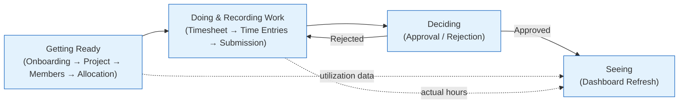
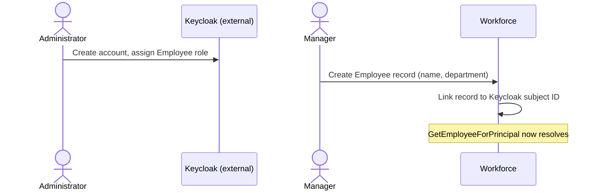
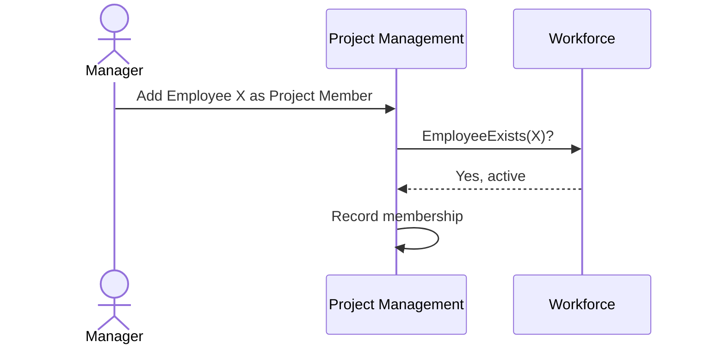
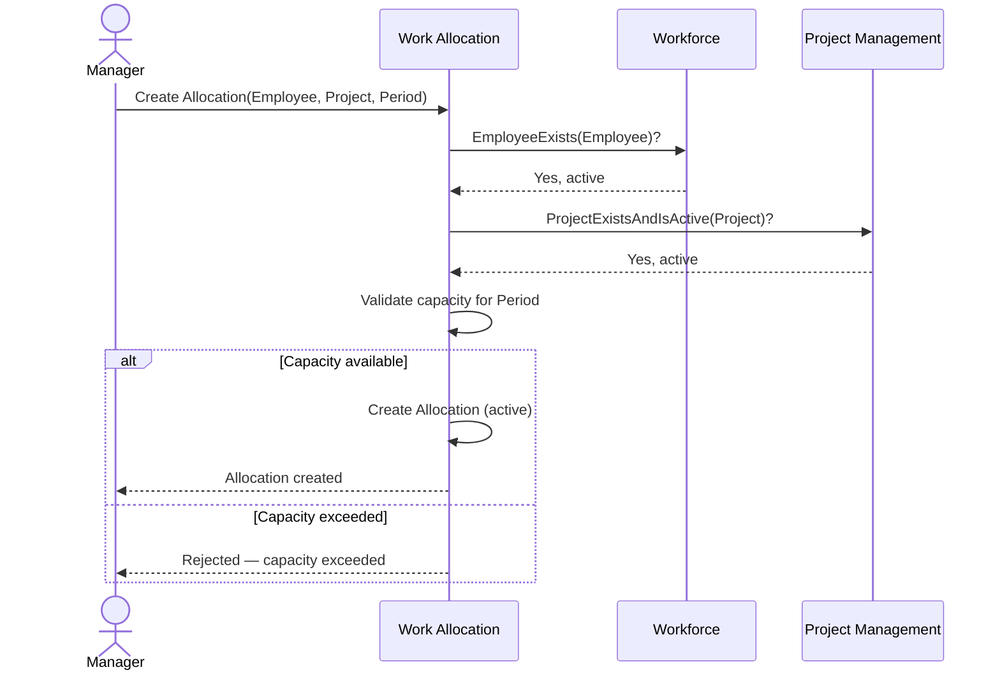
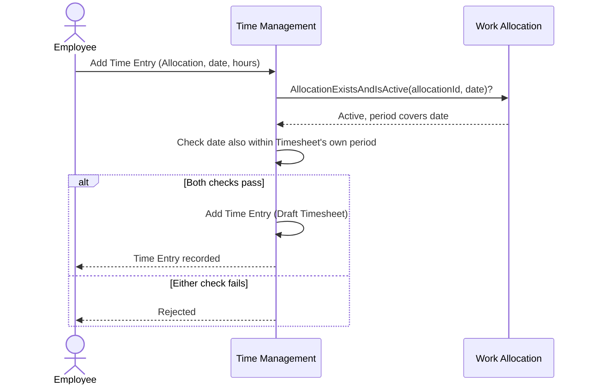
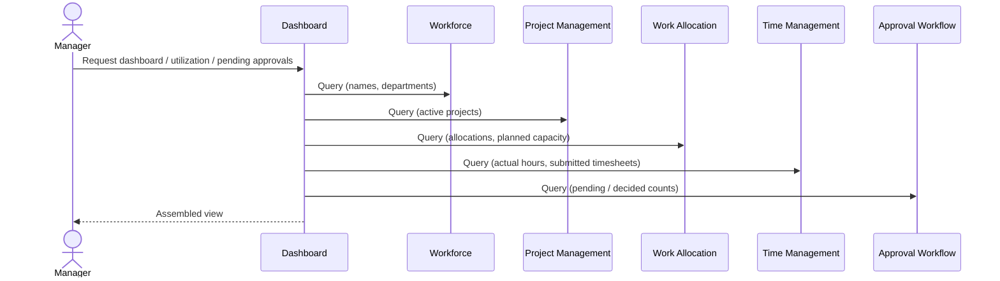

# 05 — Business Processes

**Document ID:** SYS-005
**Status:** Draft — pending review
**Version:** 1.0.0

---

## 1. Purpose

A use case (`04-use-cases.md`) is one actor's interaction with the system, evaluated in isolation — "Approve Timesheet" describes what happens when a Manager approves, full stop. But no timesheet gets approved without first being created, filled in, and submitted, and a rejection sends it back to a step the use case catalog already covered without saying so. A business process is the connective tissue: it follows one piece of work across every use case it touches, in order, including the loops a single use case's "alternative flow" can only gesture at.

This matters here specifically because `04-use-cases.md` already established that Reject Timesheet reopens a Timesheet to draft state — but a use case, by definition, doesn't show what happens *next*, across a use-case boundary. This document does: it traces "Employee submits, Manager rejects, Employee edits and resubmits" as one continuous story, which is exactly the shape a rule like "an approved timesheet is immutable" needs to be checked against, not just declared.

---

## 2. Workflow Overview

Chrona v1 implements ten business processes, in four natural groups:

**Getting Ready** — bringing the raw material of allocation into existence.
- Employee Onboarding
- Project Creation
- Project Member Assignment
- Employee Allocation

**Doing and Recording Work** — turning a plan into a record of what actually happened.
- Timesheet Creation
- Time Entry Recording
- Timesheet Submission

**Deciding** — a Manager's judgment on submitted work.
- Timesheet Approval
- Timesheet Rejection

**Seeing** — making all of the above visible.
- Dashboard Refresh

Rejection is the one loop in an otherwise linear story: it sends work back from Deciding to Doing and Recording Work, not forward. Section 3 traces each of the ten processes individually — this diagram is the map, not the territory.

---

## 3. Business Processes

### Employee Onboarding

- **Goal:** Get a new employee able to use Chrona and be identified correctly by the rest of the system.
- **Participants:** Administrator (Keycloak-side, outside Chrona's boundary per `02-system-context.md`), Manager.
- **Preconditions:** The person has been hired and needs system access.
- **Trigger:** A new employee joins the organization.
- **Main Flow:**
  1. The Administrator creates the person's account in Keycloak and assigns them the Employee role. *(External to Chrona — a precondition of what follows, not a step Chrona performs.)*
  2. A Manager creates the corresponding Employee record in Chrona (Manage Employees), recording name and department.
  3. The Employee record is linked to the Keycloak subject ID from step 1, so `GetEmployeeForPrincipal` resolves correctly the first time the person logs in.
  4. The new employee logs in (Login) and can View Profile.
- **Alternative Flows:**
  - The Employee record is created before the Keycloak account exists, or the two are linked to the wrong subject ID: the person can log in, but View Profile fails (per `04-use-cases.md`'s alternative flow for that use case) — a provisioning error, not a normal path, and one that should be caught at onboarding time, not discovered by the employee.
- **Business Rules Involved:** An Employee must resolve to exactly one Keycloak subject ID (`03-module-design.md` — Workforce's exclusive ownership of this mapping).
- **Postconditions:** The employee has a working Chrona identity and can be assigned to Departments, Projects, and Allocations going forward.

---

### Project Creation

- **Goal:** Establish a new Project so work can eventually be allocated against it.
- **Participants:** Manager.
- **Preconditions:** None beyond being authenticated as a Manager.
- **Trigger:** A Manager needs to start tracking a new piece of work.
- **Main Flow:**
  1. The Manager creates a Project (Create Project).
  2. Project Management validates the details and persists the Project in an active state.
- **Alternative Flows:**
  - Invalid or duplicate project name: rejected; the Manager corrects and resubmits.
- **Business Rules Involved:** A Project must be active before it can be referenced by an Allocation (`03-module-design.md`, Project Management → Work Allocation).
- **Postconditions:** The Project exists, is active, and is available for Project Member Assignment and Employee Allocation.

This process is a single step end to end — no diagram earns its place here that the prose doesn't already say more plainly.

---

### Project Member Assignment

- **Goal:** Establish who is associated with a Project, ahead of anyone being formally allocated to it.
- **Participants:** Manager, Workforce (validates the Employee).
- **Preconditions:** The Project exists and is active; the Employee exists in Workforce.
- **Trigger:** A Manager decides someone should be associated with a Project.
- **Main Flow:**
  1. The Manager selects a Project and an Employee (Manage Project Members).
  2. Project Management confirms the Employee exists via Workforce.
  3. Project Management records the membership.
- **Alternative Flows:**
  - The Employee doesn't exist or is deactivated: rejected.
  - The Project is archived: rejected — membership shouldn't change on a Project no longer accepting new activity. *(`04-use-cases.md` didn't state this explicitly for Manage Project Members; recorded here for consistency with Archive Project's effect on Create Allocation. Flagged in Section 6.)*
- **Business Rules Involved:** An Employee must exist and be active in Workforce before being added as a Project Member (`03-module-design.md`, Project Management → Workforce).
- **Postconditions:** The Employee is recorded as a member of the Project. This does not reserve any of their capacity — that only happens through Employee Allocation.

---

### Employee Allocation

- **Goal:** Reserve an Employee's capacity against a Project for a period — the central planning decision Chrona exists to support.
- **Participants:** Manager, Workforce (validates the Employee), Project Management (validates the Project), Work Allocation.
- **Preconditions:** The Employee exists and is active; the Project exists and is active. *(Whether the Employee must already be a Project Member first is not required by `04-use-cases.md` — see Open Questions.)*
- **Trigger:** A Manager needs to plan who works on what, and for how long.
- **Main Flow:**
  1. The Manager selects an Employee, a Project, and a period (Create Allocation).
  2. Work Allocation confirms the Employee exists via Workforce.
  3. Work Allocation confirms the Project exists and is active via Project Management.
  4. Work Allocation validates that the new allocation does not exceed the Employee's capacity for the period, considering their existing active allocations.
  5. Work Allocation creates the Allocation in an active state.
- **Alternative Flows:**
  - The Employee's capacity would be exceeded: rejected; the Manager adjusts the period, the amount, or an existing allocation first.
  - The Project is archived or doesn't exist: rejected.
  - The Employee doesn't exist or is deactivated: rejected.
  - Later changes to an existing Allocation: Modify Allocation and Cancel Allocation (`04-use-cases.md`) are their own use cases, not a separate business process — they don't cross module boundaries the way creation does.
- **Business Rules Involved:** Capacity cannot be exceeded (`01-system-overview.md` §6; `03-module-design.md` — Work Allocation's exclusive ownership of allocation business rules); an Allocation may only reference an existing, active Employee and an existing, active Project.
- **Postconditions:** An active Allocation exists. Time Management can now validate Time Entries against it (see Time Entry Recording).

---

### Timesheet Creation

- **Goal:** Open a new reporting period's Timesheet, ready to receive Time Entries.
- **Participants:** Employee, Time Management.
- **Preconditions:** None beyond authentication — a Timesheet doesn't require an existing Allocation to be created (`04-use-cases.md`, Create Timesheet).
- **Trigger:** A new reporting period begins, or the Employee chooses to start logging time for one.
- **Main Flow:**
  1. The Employee opens a new Timesheet for a reporting period (Create Timesheet).
  2. Time Management creates it in Draft status (`06-domain-model.md`, Section 3).
- **Alternative Flows:**
  - A Timesheet already exists for that Employee and period: the existing one is reused rather than duplicated (`04-use-cases.md`, Create Timesheet).
- **Business Rules Involved:** A Timesheet's initial state is Draft (`11-state-diagrams.md`, Section 3 — `[*] --> Draft`).
- **Postconditions:** A Draft Timesheet exists for the period, ready to receive Time Entries.

This process is a single step end to end — no diagram earns its place here that the prose doesn't already say more plainly, matching Project Creation earlier in this document.

---

### Time Entry Recording

- **Goal:** Record hours worked on a specific date against a specific Allocation.
- **Participants:** Employee, Time Management, Work Allocation (validates the Allocation).
- **Preconditions:** A Draft Timesheet exists for the period; the referenced Allocation exists and is active.
- **Trigger:** The Employee has worked time to record.
- **Main Flow:**
  1. The Employee selects an Allocation and enters hours worked on a date (Add Time Entry).
  2. Time Management confirms the Allocation exists and is active via Work Allocation (`03-module-design.md`, Time Management → Work Allocation).
  3. Time Management confirms the entry's date falls within both the Allocation's period and the Timesheet's own period — the second half of this check was added when `06-domain-model.md` was revised during `07-er-diagram.md`'s architecture review.
  4. Time Management adds the Time Entry to the Draft Timesheet.
- **Alternative Flows:**
  - The Allocation is not active, or its period doesn't cover the date: rejected.
  - The date falls outside the Timesheet's own period, even where the Allocation would otherwise allow it: rejected (`06-domain-model.md`, Section 3, as revised).
  - The Timesheet is not in Draft status: rejected.
- **Business Rules Involved:** an employee cannot log time outside an active Allocation (`01-system-overview.md`, `06-domain-model.md`); a Time Entry's date must fall within both its Allocation's period and its Timesheet's period (`06-domain-model.md`, Section 3, revised; `07-er-diagram.md`, Section 4).
- **Postconditions:** The Time Entry is recorded against the Draft Timesheet.

---

### Timesheet Submission

- **Goal:** Close a Timesheet to further edits and make it visible to Approval Workflow for a decision.
- **Participants:** Employee, Time Management.
- **Preconditions:** The Timesheet is in Draft status and contains at least one Time Entry.
- **Trigger:** The reporting period has ended, or the Employee is otherwise ready for review.
- **Main Flow:** See `09-sequence-diagrams.md`, Section 4 (Submit Timesheet) for the full request-to-database sequence — not repeated here. In business-process terms: the Employee submits; Time Management confirms Draft status and at least one Time Entry; the Timesheet transitions to Submitted and records `LastSubmittedAtUtc` (`06-domain-model.md`, Section 3).
- **Alternative Flows:** an empty Timesheet is rejected; a Timesheet not in Draft status is rejected (`04-use-cases.md`, Submit Timesheet).
- **Business Rules Involved:** a Timesheet cannot be submitted with zero Time Entries; Draft → Submitted is the only valid transition from here (`11-state-diagrams.md`, Section 3).
- **Postconditions:** The Timesheet is Submitted and read-only to the Employee until a Manager acts on it.

---

### Timesheet Approval

- **Goal:** Record a Manager's decision that submitted work is correct, and make that decision permanent.
- **Participants:** Manager, Workforce (authority check), Time Management (status change), Approval Workflow.
- **Preconditions:** The Timesheet is Submitted; the Manager has authority over the owning Employee; the Manager is not the Timesheet's own Employee.
- **Trigger:** The Manager has reviewed the Timesheet and finds it correct.
- **Main Flow:** See `09-sequence-diagrams.md`, Section 5 (Approve Timesheet) for the full sequence — not repeated here. In business-process terms: Approval Workflow confirms authority via Workforce, confirms the Manager isn't approving their own Timesheet, records the decision, and instructs Time Management to mark the Timesheet Approved.
- **Alternative Flows:** no authority over the Employee is rejected; self-approval is rejected (`04-use-cases.md`, Approve Timesheet).
- **Business Rules Involved:** manager authority; no self-approval; Approved is terminal and immutable (`06-domain-model.md`, Section 3; `11-state-diagrams.md`, Section 3).
- **Postconditions:** The Timesheet is Approved and immutable; an Approval record exists.

---

### Timesheet Rejection

- **Goal:** Send a submitted Timesheet back for correction, with a reason.
- **Participants:** Manager, Workforce (authority check), Time Management (status change), Approval Workflow.
- **Preconditions:** The Timesheet is Submitted; the Manager has authority over the owning Employee.
- **Trigger:** The Manager finds an error in the submission.
- **Main Flow:** See `09-sequence-diagrams.md`, Section 6 (Reject Timesheet) for the full sequence — not repeated here. In business-process terms: Approval Workflow confirms authority, confirms a reason was provided, records the decision, and instructs Time Management to reopen the Timesheet to Draft.
- **Alternative Flows:** no reason given is rejected; no authority over the Employee is rejected (`04-use-cases.md`, Reject Timesheet).
- **Business Rules Involved:** a reason is mandatory for rejection; Submitted → Draft is the only backward transition in the entire domain model (`06-domain-model.md`, Section 8; `11-state-diagrams.md`, Section 3).
- **Postconditions:** The Timesheet is back in Draft; the Employee can Edit Time Entries and Submit again — closing the loop back into "Doing and Recording Work" that Section 2's overview diagram already showed.

---

### Dashboard Refresh

- **Goal:** Give a Manager a current, accurate view across five other modules, without Dashboard owning any of that data itself.
- **Participants:** Manager, Dashboard, and every module it queries — Workforce, Project Management, Work Allocation, Time Management, Approval Workflow.
- **Preconditions:** None beyond authentication as a Manager.
- **Trigger:** The Manager opens the dashboard, or any of its three views (`04-use-cases.md`).
- **Main Flow:**
  1. The Manager requests the dashboard, utilization, or pending-approvals view.
  2. Dashboard queries each relevant module directly — never a cached or precomputed copy. An event-driven refresh was considered and explicitly rejected as solving a problem the system doesn't have (`03-module-design.md`, Section 5).
  3. Dashboard assembles the response from live query results and returns it.
- **Alternative Flows:** one of the underlying modules is unavailable: the affected panel shows a clear "unavailable" state rather than a stale or silently incorrect number (`04-use-cases.md`, View Dashboard).
- **Business Rules Involved:** Dashboard never owns business data (`03-module-design.md`, Dependency Rule 1); every number shown is a live query, never a duplicate (`06-domain-model.md`, Section 9 — Dashboard queries live in v1).
- **Postconditions:** None — the one process in this document that changes nothing; it only reads.

---

## 4. Cross-Process Business Rules

`06-domain-model.md`, Section 8 already pulled the domain-level invariants together by kind. This section is the same exercise at the process level — which rules show up across more than one of the ten processes above, not within just one.

- **Existence-and-activity validation, at the moment of reference:** Project Member Assignment (validates the Employee), Employee Allocation (validates the Employee and the Project), and Time Entry Recording (validates the Allocation) all apply the identical pattern — confirm a cross-aggregate reference is real and active right now, never on a schedule (`06-domain-model.md`, Section 8, Pattern 1).
- **Manager authority, checked fresh every time:** Timesheet Approval and Timesheet Rejection both open with the identical check — does this Manager have authority over this Employee — via the same Workforce capability, `IsManagerOf` (`03-module-design.md`). Neither process, nor any other, caches or reuses a prior authority result.
- **Immutability after a terminal state:** Employee Allocation's Cancel path, Project's Archive, and Timesheet Approval's Approved outcome all share the same shape — once reached, the record stays fully readable but closed to further change (`06-domain-model.md`, Section 8, Pattern 3; `11-state-diagrams.md`).
- **Draft-only mutation:** Time Entry Recording requires its owning Timesheet to be in Draft — the same precondition that governs Edit Time Entry, since both touch the same aggregate under the same rule (`06-domain-model.md`, Section 3).

---

## 5. Failure Scenarios

| Failure | Where it applies | System response |
|---|---|---|
| Acting on a resource in the wrong state (submitting an already-Submitted Timesheet, approving a Draft one) | Timesheet Submission, Timesheet Approval, Timesheet Rejection | Rejected — only the transitions `11-state-diagrams.md` defines for that entity are valid. |
| Referencing an inactive or nonexistent Employee, Project, or Allocation | Project Member Assignment, Employee Allocation, Time Entry Recording | Rejected before any further processing — existence-and-activity is always checked first (Section 4). |
| A Time Entry's date falling outside its Allocation's period, its Timesheet's period, or both | Time Entry Recording | Rejected — both checks are independent; either one failing is sufficient (`06-domain-model.md`, Section 3, as revised). |
| A Manager acting without authority over the Employee in question | Timesheet Approval, Timesheet Rejection | Rejected — checked fresh against Workforce every time (Section 4). |
| A Manager attempting to approve or reject their own Timesheet | Timesheet Approval, Timesheet Rejection | Rejected outright, regardless of authority (`06-domain-model.md`, Section 3). |
| A Timesheet submitted with zero Time Entries | Timesheet Submission | Rejected (`04-use-cases.md`, Submit Timesheet). |
| A Timesheet rejected with no reason given | Timesheet Rejection | Rejected — a reason is mandatory for a rejection, though not for an approval (`06-domain-model.md`, Section 3). |
| One of Dashboard's underlying modules is unavailable | Dashboard Refresh | The affected panel shows an explicit "unavailable" state — never a stale or silently incorrect number (`04-use-cases.md`, View Dashboard). |

---

## 6. Design Decisions

### Decisions made

- Timesheet Submission, Approval, and Rejection cross-reference `09-sequence-diagrams.md` for their sequence diagrams rather than duplicating one — those three were already diagrammed there, in full-stack detail, after this document was originally started, and redrawing them here risked the same kind of diagram-disagreement flagged in the most recent cross-document review.
- Time Entry Recording's business rules and diagram reflect the cross-period invariant added during `07-er-diagram.md`'s architecture review — this document is now consistent with that revision, not the earlier version of `06-domain-model.md` it predates.
- Dashboard Refresh is documented as a pure fan-out to five modules with no caching, consistent with `03-module-design.md`'s explicit rejection of an event-driven refresh as solving a problem the system doesn't have.

### Open Questions

None new from this closing set — every process above was derivable from decisions already made in `06`–`09`.

### Deferred to v2

- Dashboard caching: not implemented, per `03-module-design.md`, Section 5 — revisit only if and when live queries prove too slow, not before.

05-business-processes.md complete.