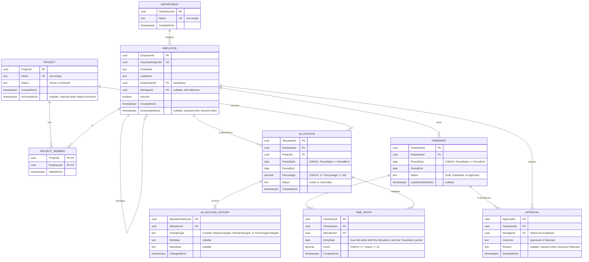

# 07 — ER Diagram

**Document ID:** SYS-007
**Status:** Approved
**Version:** 1.1.0 (revised after architecture review)

---

## 1. Purpose

This document models Chrona v1's persistent data structure — tables, columns, keys, and relationships. It exists downstream of `06-domain-model.md`, not the other way around: every table here corresponds to an aggregate or entity already named there, and every column corresponds to something that document already decided was part of that entity's identity or state. If this diagram and the domain model ever disagree, the domain model is the one that's right, and this document needs to change to match it — not the reverse.

This is also the first document in the set that commits to implementation-level choices `06-domain-model.md` deliberately left open — a Value Object doesn't have an opinion about whether it's a database column, but a table does, and that translation happens here, explicitly, rather than being left for whoever writes the first EF Core migration to decide informally.

---

## 2. Design Principles

**Normalize where appropriate.** Every table below is in at least third normal form — no repeating groups, no column whose value is derivable from another column in the same row. The one deliberate exception: Value Objects (`AllocationPeriod`, `AllocationPercentage`, and so on) are flattened onto their owning entity's table rather than split into their own tables, because they have no identity of their own and are never queried independently of their owner — see Section 5.

**Avoid premature optimization.** No denormalization and no computed or cached columns appear in this document. Indexes are the one exception worth being precise about: PostgreSQL does not automatically index a foreign key column the way some databases do, so every foreign key here gets an explicit index — not as speculative tuning, but as a correctness-adjacent baseline every `Restrict`-behavior delete relies on (Section 5). Beyond that baseline, and one evidence-based addition tied to an actual named query (`04-use-cases.md`'s View Pending Approvals), nothing here is indexed speculatively.

**Preserve aggregate boundaries where possible.** Every aggregate from `06-domain-model.md` maps to exactly one cluster of tables it alone owns: `Allocation` + `AllocationHistory`, `Project` + `ProjectMember`, `Timesheet` + `TimeEntry`. No table is shared or jointly owned by two aggregates. The one boundary a relational schema can't fully preserve is enforcement — a foreign key can guarantee a `ProjectId` on `Allocation` refers to a real row, but it can't enforce "the Project must be active." That stays an application-level invariant (`06-domain-model.md`, Section 8), not a database constraint.

**Referential integrity through foreign keys.** Every reference identified as a domain-level relationship in `06-domain-model.md` is a real foreign key constraint here, not an unenforced convention. The database rejects an orphaned reference even if application code has a bug — a second line of defense behind the validations `06-domain-model.md` already describes at the domain layer.

**Auditability.** `AllocationHistory` exists specifically because `06-domain-model.md` commits to it — including, as of this revision, an explicit first entry the moment an Allocation is created. Every table now carries at least a creation timestamp, and several carry decision or transition timestamps that the domain model already established a real need for.

**Simplicity over unnecessary complexity.** No table in this schema exists without a corresponding entity already named in `06-domain-model.md`. Nothing is added "for flexibility" or "in case it's needed later" — a schema is exactly the wrong place to speculate, since every unused column and table is something a future migration has to either honor or clean up.

---

## 3. Entity Relationship Diagram

Nine tables, matching `06-domain-model.md`'s nine entities exactly — no more, no fewer. `ALLOCATION ||--|{ ALLOCATION_HISTORY` is one-or-many, not zero-or-many, because `06-domain-model.md` now states explicitly that creation itself writes the first entry — this diagram no longer assumes that, it reflects it. Every other one-to-many relationship allows zero on the "many" side, including `TIMESHEET ||--o{ TIME_ENTRY` — a freshly created Timesheet legitimately has none yet; that a Timesheet *cannot be submitted* with zero entries is an application-level rule, not a schema-level one, consistent with the "Preserve aggregate boundaries" principle above. Inline comments in quotes mark where a `CHECK` constraint or conditional-nullability rule applies — full definitions are in Section 5, not here, to keep the diagram itself readable.

---

## 4. Relationship Explanation

Twelve relationships connect nine tables. Before going through each one, the pattern that decides delete behavior across all of them: **Cascade** is used only where the child has no meaning outside its parent and lives in the same aggregate (`06-domain-model.md`, Section 3's "Owned Entities"). **Restrict** is used everywhere a reference crosses an aggregate boundary and the referenced row represents a permanent business record — an Allocation, a Timesheet, an Approval — that must never disappear silently because something else was removed. **Set Null** is used exactly once, for the one relationship that's genuinely optional and doesn't represent ownership at all.

### Workforce

**Department → Employee**
- **Why it exists:** every Employee belongs to exactly one organizational Department — mandatory, per `06-domain-model.md`'s corrected Section 3.
- **Cardinality:** one Department to zero-or-many Employees.
- **Ownership:** Department does not own Employee — they're separate aggregates (`06-domain-model.md`, Section 3) that merely reference each other.
- **Delete behavior:** Restrict. This is the database enforcing a rule `04-use-cases.md` already states in prose — a Department cannot be removed while Employees are still assigned to it. The foreign key makes that impossible to violate by accident, not just by convention.

**Employee → Employee (manages)**
- **Why it exists:** an Employee may have another Employee as their reporting Manager.
- **Cardinality:** one Employee to zero-or-many direct reports; each Employee has zero-or-one Manager.
- **Ownership:** neither owns the other — a self-reference between peers, not a parent-child relationship.
- **Delete behavior:** Set Null. If a Manager's own Employee record were ever removed, their direct reports shouldn't be deleted along with them, and blocking the operation entirely is disproportionate for what's already a nullable, optional relationship — their `ManagerId` simply becomes null.

### Project Management

**Project → ProjectMember**
- **Why it exists:** records which Employees are associated with a Project.
- **Cardinality:** one Project to zero-or-many ProjectMembers.
- **Ownership:** Project owns ProjectMember outright — a child entity within Project's aggregate (`06-domain-model.md`, Section 3), with no independent existence.
- **Delete behavior:** Cascade. A ProjectMember record is meaningless without its Project; if the Project genuinely goes away, its membership records have nothing left to describe.

**Employee → ProjectMember**
- **Why it exists:** each membership record identifies which Employee it refers to.
- **Cardinality:** one Employee to zero-or-many ProjectMember records, across different Projects.
- **Ownership:** neither — Employee is referenced, not owned, by ProjectMember, which belongs to Project's aggregate instead.
- **Delete behavior:** Restrict. An Employee shouldn't be removable while they're still a member of any Project; membership must be explicitly ended first, on Project Management's terms.

### Work Allocation

**Employee → Allocation**
- **Why it exists:** every Allocation reserves capacity for exactly one Employee.
- **Cardinality:** one Employee to zero-or-many Allocations.
- **Ownership:** neither — Allocation references `EmployeeId` without owning Employee data (`06-domain-model.md`, Section 4).
- **Delete behavior:** Restrict. An Employee with any Allocation history should never be removable; deactivation, not deletion, is v1's only path for an Employee leaving (`06-domain-model.md`, Section 4).

**Project → Allocation**
- **Why it exists:** every Allocation reserves capacity against exactly one Project.
- **Cardinality:** one Project to zero-or-many Allocations.
- **Ownership:** neither — the same reference-not-ownership relationship as above, mirrored for Project.
- **Delete behavior:** Restrict. A Project with any Allocation history should never be removable — archiving, not deletion, is how a Project is retired (`04-use-cases.md`, Archive Project).

**Allocation → AllocationHistory**
- **Why it exists:** every change to an Allocation's status, period, or percentage is recorded as it happens — including the Allocation's own creation, which writes the first entry (`06-domain-model.md`, Section 3, as revised).
- **Cardinality:** one Allocation to one-or-many AllocationHistory entries — never zero.
- **Ownership:** Allocation owns AllocationHistory outright — a child entity within its aggregate, with no independent existence.
- **Delete behavior:** Cascade — reviewed and deliberately kept, not an oversight. The case for Restrict is real (an audit trail arguably shouldn't disappear with its subject), but v1 never deletes an Allocation in normal operation, only cancels it; the risk Restrict would guard against stays theoretical, and adding it now would be protecting against an operation the system doesn't perform, ahead of evidence that it ever will.

### Time Management

**Employee → Timesheet**
- **Why it exists:** every Timesheet belongs to exactly one Employee.
- **Cardinality:** one Employee to zero-or-many Timesheets.
- **Ownership:** neither — reference, not ownership.
- **Delete behavior:** Restrict. An Employee with any Timesheet history — especially an Approved one — should never be removable.

**Timesheet → TimeEntry**
- **Why it exists:** a Timesheet collects the Time Entries recorded against it for its reporting period. As of this revision, every Time Entry's date must fall within that same period (`06-domain-model.md`, Section 3, as revised) — not just within its Allocation's period, which was the only check originally stated.
- **Cardinality:** one Timesheet to zero-or-many TimeEntries.
- **Ownership:** Timesheet owns TimeEntry outright — a child entity within its aggregate (`06-domain-model.md`, Section 3).
- **Delete behavior:** Cascade. A TimeEntry has no meaning outside the Timesheet that contains it.

**Allocation → TimeEntry**
- **Why it exists:** every Time Entry is validated against, and references, the specific Allocation the work was performed under — the entry's date must fall within the Allocation's period, and, per the same revision, within the owning Timesheet's period too.
- **Cardinality:** one Allocation to zero-or-many TimeEntries.
- **Ownership:** neither — TimeEntry belongs to Timesheet's aggregate, and only references `AllocationId` (`06-domain-model.md`, Section 4).
- **Delete behavior:** Restrict. An Allocation with any recorded Time Entries against it should never be removable — those entries are a permanent record of work performed, owned by a different aggregate entirely.

### Approval Workflow

**Timesheet → Approval**
- **Why it exists:** every Approval decision is about exactly one Timesheet.
- **Cardinality:** one Timesheet to zero-or-many Approval records over its lifetime — more than one only if it was rejected and resubmitted before eventually being decided again.
- **Ownership:** neither — Approval references `TimesheetId` without Timesheet ever knowing its Approval records exist (`06-domain-model.md`, Section 4's explicit point about dependency direction).
- **Delete behavior:** Restrict. A Timesheet with any recorded decision should never be removable — "approval does not modify history" (`06-domain-model.md`, Section 3) extends to the Timesheet itself never disappearing out from under a decision made about it.

**Employee → Approval**
- **Why it exists:** every Approval records which Manager made the decision.
- **Cardinality:** one Employee, acting as Manager, to zero-or-many Approval records they've decided.
- **Ownership:** neither — reference only.
- **Delete behavior:** Restrict. Same reasoning as Employee → Timesheet and Employee → Allocation: an Employee with any decision on record should never be removable.

---

## 5. Persistence Notes

**Soft delete strategy.** Section 4's Restrict-heavy pattern only works because almost nothing in this schema is ever actually deleted. Five tables use a status field as a soft-delete in all but name — `Employee.IsActive`, `Project.Status`, `Allocation.Status`, and `Timesheet`/`Approval`, which have no removal path defined at all in v1. Exactly two tables are genuinely, physically deleted in normal operation: `Department` (once nothing references it) and `ProjectMember` (when membership ends — it has no status column at all, per Section 3).

**Audit columns.** Every table now carries at least a `CreatedAtUtc` — `Department` and `TimeEntry` both gained one in this revision, closing the two gaps found in review. `TimeEntry.CreatedAtUtc` is deliberately distinct from `EntryDate`: the first is when the row was recorded, the second is the business date the work happened on, and they can legitimately differ. Transition-specific timestamps exist wherever `06-domain-model.md` established a real need for one: `DeactivatedAtUtc` (Employee), `ArchivedAtUtc` (Project), `ChangedAtUtc` per entry (AllocationHistory), `LastSubmittedAtUtc` (Timesheet), `DecidedAtUtc` (Approval), `AddedAtUtc` (ProjectMember). `CreatedBy`/`ChangedBy`-style attribution columns were considered during review and are explicitly not part of this revision — see Section 6.

**CHECK constraints.** Six categories, all added in this revision:
- `Allocation.Percentage`: `CHECK (Percentage > 0 AND Percentage <= 100)`.
- `Allocation.PeriodStart <= Allocation.PeriodEnd`, and the same pair on `Timesheet`.
- `TimeEntry.Hours`: `CHECK (Hours > 0 AND Hours <= 24)`.
- Non-empty names: `Department.Name` and `Project.Name` both get `CHECK (length(trim(Name)) > 0)`, on top of their existing `NOT NULL` and uniqueness constraints — a required, unique, empty string would otherwise satisfy both.
- Status/companion-field consistency, one `CHECK` per pair, all one-directional to match `06-domain-model.md`'s exact wording (a value is *required* in one state, not *forbidden* in the other):
  - `CHECK (Status <> 'Archived' OR ArchivedAtUtc IS NOT NULL)` on `Project`.
  - `CHECK (IsActive = true OR DeactivatedAtUtc IS NOT NULL)` on `Employee`.
  - `CHECK (Outcome <> 'Rejected' OR Reason IS NOT NULL)` on `Approval`.

**Unique constraints.** `Employee.KeycloakSubjectId`, `Department.Name`, `Project.Name`. `ProjectMember`'s composite primary key (`ProjectId`, `EmployeeId`) is itself a uniqueness constraint — the same Employee cannot be added to the same Project twice — expressed through the key structure rather than a separate `UNIQUE` constraint.

**Composite keys.** `ProjectMember` is the only table with one. Every other table has an independent identity of its own (a surrogate `uuid`) even when it's a child entity — `TimeEntry` and `AllocationHistory` both get their own generated ID rather than a composite key, because, unlike `ProjectMember`, their identity isn't naturally a pairing of two other IDs; a Timesheet can have many TimeEntries on the same Allocation, so `(TimesheetId, AllocationId)` wouldn't even be unique.

**Nullable relationships.** `Employee.ManagerId` (optional by design, per `06-domain-model.md`, Section 4), `Employee.DeactivatedAtUtc`, `Project.ArchivedAtUtc`, `Timesheet.LastSubmittedAtUtc` (null until the first submission), `AllocationHistory.OldValue`/`NewValue` (a "Created" entry has no prior value). Three of these — `DeactivatedAtUtc`, `ArchivedAtUtc`, and `Approval.Reason` — are nullable *and* conditionally required; that pairing is now enforced by the `CHECK` constraints above rather than left as prose-only.

**Indexing.** Every foreign key in Section 3 is explicitly indexed — twelve indexes, one per relationship in Section 4. This isn't speculative: PostgreSQL doesn't index foreign key columns automatically, and every `Restrict`-behavior delete (eight of the twelve relationships) requires scanning the child table for matching rows before Postgres can allow or deny the delete. Without the index, that scan is a full table scan, on every delete attempt, and it only gets worse as the tables grow. One further index, beyond the FK baseline: `Timesheet.Status`, serving `04-use-cases.md`'s View Pending Approvals query directly — "submitted Timesheets... filtered to those without a recorded decision" is a real, named, frequent query path, not a guess.

**Value Object persistence strategy.** Every Value Object from `06-domain-model.md`, Section 5 is flattened onto its owning table as plain columns — `AllocationPeriod` becomes `PeriodStart`/`PeriodEnd` on `Allocation`, not a separate table joined by a foreign key — because none of them have identity of their own or are ever queried independently of their owner. The four state-shaped Value Objects (`ProjectStatus`, `AllocationStatus`, `TimesheetStatus`, `ApprovalOutcome`) are stored as `text` rather than a native PostgreSQL enum or a small integer, for the same reason given originally: `text` costs nothing meaningful at this scale and stays readable in a raw table browse. `AllocationHistory.ChangeType` is the one exception, and changed in this revision: it's now a constrained enumeration — `Created`, `StatusChanged`, `PeriodChanged`, `PercentageChanged` — rather than free text, since unlike a Value Object's own state, "what kind of change happened" has a small, fixed, fully-known set of answers. `OldValue`/`NewValue` remain free text; constraining *those* to a type would require knowing in advance what's being described, which changes depending on `ChangeType` — a heavier, YAGNI-violating change deferred in Section 6.

---

## 6. Design Decisions

### Decisions made

- Employee → Department is mandatory, not optional — `06-domain-model.md` corrected to match, resolving the contradiction between its own Sections 3 and 4.
- Allocation creation writes the first `AllocationHistory` entry — now stated explicitly in `06-domain-model.md`, rather than left as an assumption this document alone was making.
- Six categories of `CHECK` constraint now enforce at the database level what was previously prose-only: `Allocation.Percentage` bounds, both period pairs' start-before-end ordering, `TimeEntry.Hours` bounds, non-empty names, and the three status/companion-field pairings.
- `Department` and `TimeEntry` both gained `CreatedAtUtc`, closing the two audit gaps found in review.
- Every foreign key is indexed; `Timesheet.Status` gets an additional index tied to a named, real query path.
- `AllocationHistory.ChangeType` is now a constrained enumeration rather than free text; `OldValue`/`NewValue` remain free text.
- A new domain invariant: `TimeEntry.EntryDate` must fall within both its Allocation's period and its owning Timesheet's period — added to `06-domain-model.md` as the authoritative statement, enforced here at the application layer, since it spans two tables in a way no single-table `CHECK` constraint can reach.
- `Allocation → AllocationHistory` stays Cascade, not Restrict — reviewed and deliberately kept: v1 never deletes an Allocation in normal operation, only cancels it, so the theoretical risk to the audit trail stays theoretical, and Restrict here would guard against an operation the system doesn't perform.

### Open Questions

- Should a user be able to remove — not just edit — a mistaken `TimeEntry` while its Timesheet is still in Draft? `04-use-cases.md` defines Edit Time Entry but no Remove Time Entry. Not addressed by this revision; still open.

### Deferred to v2

- `CreatedBy` / `ChangedBy` / `ArchivedBy` / `DeactivatedBy` / `AddedBy` audit-attribution columns — considered in review, not implemented. v1's audit trail records *what* and *when* throughout; *who*, beyond what `ManagerId` on `Approval` already provides by construction, is a v2 concern.
- `Allocation.PeriodStart`/`PeriodEnd` as a PostgreSQL `daterange` column with a GiST index — the highest-value single change identified in review, and explicitly not applied now. Revisit if the Capacity Validator's overlap query becomes a real, measured performance concern.
- `AllocationHistory.OldValue`/`NewValue` moving from free text to structured, per-field typed columns — not needed until a concrete requirement to query history by field appears.

---

**Status: Approved.** This document is now frozen. Any future change to what it describes goes through a new ADR-style decision, not a silent edit.