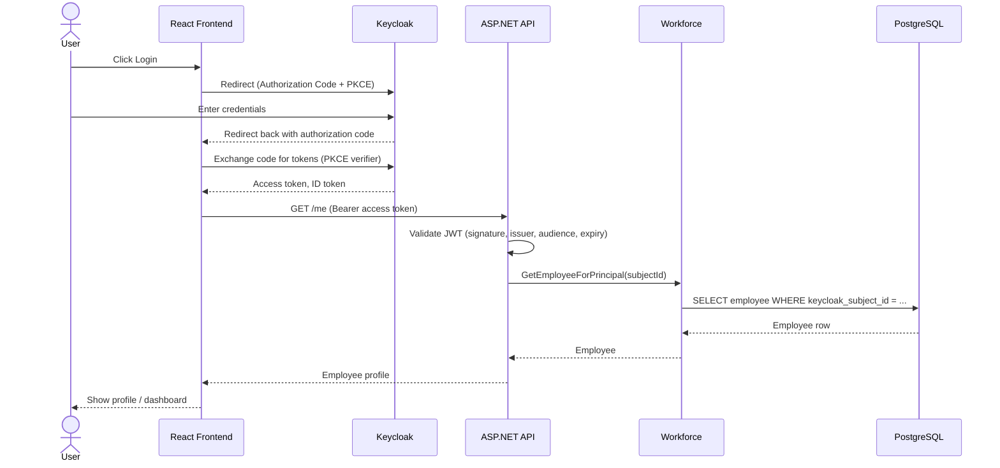
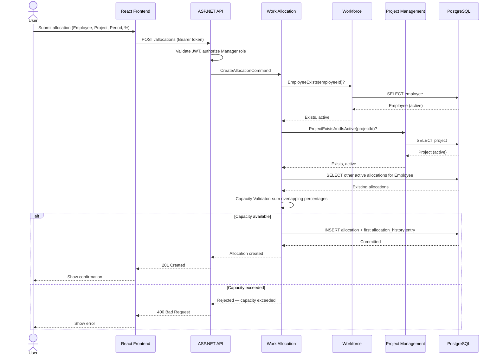
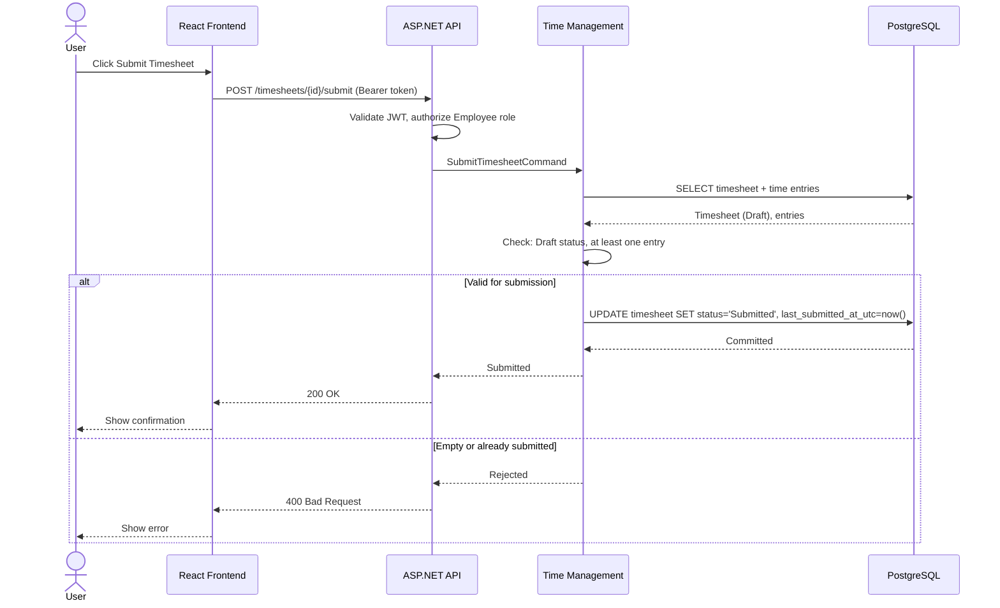
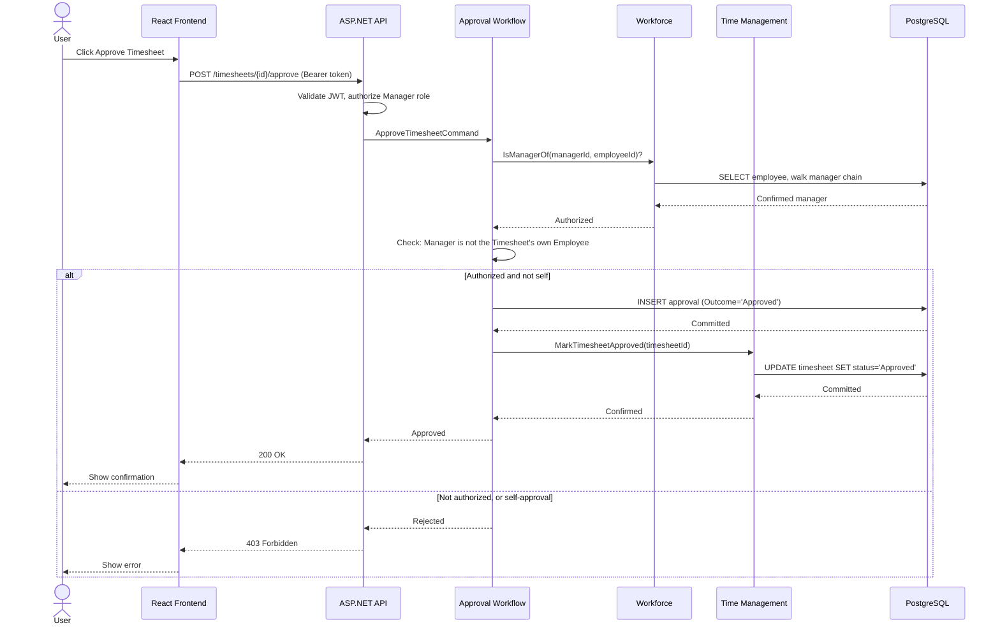
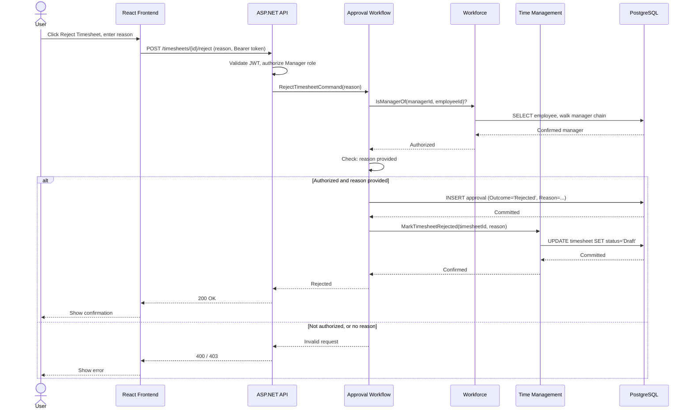

# 09 — Sequence Diagrams

**Document ID:** SYS-009
**Status:** Draft — pending review
**Version:** 1.0.0

---

## 1. Purpose

Every document so far describes Chrona v1 from a different angle — system boundaries, module responsibilities, use cases, business processes, the domain model, the schema. None of them show a single request's actual journey through every layer of the running system at once. This document does exactly that, for the five workflows that most depend on getting the layering right: the request starts at a person clicking something in the browser, and ends at a row in PostgreSQL, with every hop in between shown explicitly.

`05-business-processes.md` already traced how modules collaborate to get a business outcome done; this document adds the layers that sit above and below that collaboration — the browser, the HTTP boundary, and the database — deliberately left out of the business-process view, but essential to anyone actually building this.

---

## 2. User Login (OIDC with Keycloak)

### Purpose
Authenticate a person and establish the identity that every subsequent request in this document depends on.

### Preconditions
The user has a valid account already provisioned in Keycloak, with an Employee record in Workforce already linked to that account's subject ID (`05-business-processes.md`, Employee Onboarding).

### Participants
User, React Frontend, Keycloak, ASP.NET API, Workforce, PostgreSQL.

### Sequence Diagram

### Step-by-Step Explanation
1. The user clicks Login in the React Frontend.
2. The Frontend redirects the browser to Keycloak's authorization endpoint, starting the OIDC Authorization Code flow with PKCE.
3. The user enters credentials directly at Keycloak's own hosted login page — the Frontend never sees the password (`02-system-context.md`).
4. Keycloak validates the credentials and redirects the browser back to the Frontend with an authorization code.
5. The Frontend exchanges the code, with its PKCE verifier, directly with Keycloak's token endpoint — no backend involvement in this exchange.
6. Keycloak returns an access token and an ID token to the Frontend.
7. The Frontend calls the API's profile endpoint, attaching the access token as a Bearer header.
8. The API validates the token's signature, issuer, audience, and expiry against Keycloak's OIDC discovery document and JWKS (`02-system-context.md`).
9. The API extracts the subject ID and calls Workforce's `GetEmployeeForPrincipal`.
10. Workforce queries PostgreSQL for the Employee matching that subject ID and returns it.
11. The Frontend displays the user's profile, completing login.

### Business Rules Enforced
- A JWT must pass signature, issuer, audience, and expiry validation before any request proceeds (`02-system-context.md`).
- An Employee must resolve to exactly one Keycloak subject ID (`06-domain-model.md`, Section 3) — the rule step 9 is actually checking.

### Alternative / Failure Paths
- Invalid credentials at Keycloak: the user remains at Keycloak's login screen (`04-use-cases.md`, Login).
- A valid token with no matching Employee record: a provisioning gap, not a normal outcome — the API returns an error rather than a misleading empty profile (`04-use-cases.md`, View Profile).
- Expired or reused authorization code: Keycloak rejects the exchange; the Frontend restarts the flow from step 2.

### Postconditions
The user holds a valid access token, attached to every subsequent request in this document, and the Frontend has confirmed it resolves to a real, active Employee.

---

## 3. Create Allocation

### Purpose
Reserve an Employee's capacity against a Project for a period — the core domain operation the whole system exists to support (`06-domain-model.md`, Section 2).

### Preconditions
The Manager is authenticated; the Employee and Project both already exist.

### Participants
User (Manager), React Frontend, ASP.NET API, Work Allocation, Workforce, Project Management, PostgreSQL.

### Sequence Diagram

### Step-by-Step Explanation
1. The Manager fills in an Employee, a Project, a period, and a percentage in the Frontend, and submits.
2. The Frontend sends the request to the API with the Bearer token.
3. The API validates the token, confirms the caller holds the Manager role, then routes the command to Work Allocation.
4. Work Allocation confirms the Employee exists and is active by calling Workforce, which queries PostgreSQL.
5. Work Allocation confirms the Project exists and is active by calling Project Management, which queries PostgreSQL.
6. Work Allocation queries PostgreSQL directly for the Employee's other active Allocations, to run the Capacity Validator (`06-domain-model.md`, Section 6) — the one query this workflow relies on the composite index `allocations(employee_id, status)` for (`08-database-design.md`, Section 4).
7. If the new Allocation would not exceed 100% capacity, Work Allocation inserts the Allocation row and its first `allocation_history` entry in one transaction (`07-er-diagram.md`, Section 4).
8. The API returns success to the Frontend, which confirms to the Manager.

### Business Rules Enforced
- The Employee must exist and be active (`06-domain-model.md`, Section 3).
- The Project must exist and be active (`06-domain-model.md`, Section 3).
- The sum of the Employee's overlapping active Allocations may never exceed 100% (`06-domain-model.md`, Section 3 and Section 6).
- Allocation creation always writes a first `AllocationHistory` entry (`07-er-diagram.md`'s revision to `06-domain-model.md`).

### Alternative / Failure Paths
- The Employee doesn't exist or is deactivated: rejected before capacity is ever checked.
- The Project doesn't exist or is archived: rejected the same way.
- Accepting the new Allocation would exceed 100% capacity: rejected; the Manager must adjust the period, percentage, or an existing Allocation first (`04-use-cases.md`, Create Allocation).

### Postconditions
An active Allocation exists in PostgreSQL, with one `AllocationHistory` entry, and Time Management can now validate Time Entries against it.

---

## 4. Submit Timesheet

### Purpose
Close a Timesheet to further edits and make it visible to Approval Workflow for a decision.

### Preconditions
The Employee is authenticated and owns a Timesheet currently in Draft status.

### Participants
User (Employee), React Frontend, ASP.NET API, Time Management, PostgreSQL.

### Sequence Diagram

### Step-by-Step Explanation
1. The Employee clicks Submit on a draft Timesheet in the Frontend.
2. The Frontend sends the request to the API with the Bearer token.
3. The API validates the token and routes the command to Time Management.
4. Time Management loads the Timesheet and its Time Entries from PostgreSQL.
5. Time Management checks that the Timesheet is in Draft status and has at least one Time Entry (`06-domain-model.md`, Section 3).
6. If valid, Time Management updates the Timesheet's status to Submitted and records `last_submitted_at_utc` — the exact field Approval's "pending" derivation depends on (`06-domain-model.md`, Section 3).
7. The API confirms to the Frontend, which confirms to the Employee.

### Business Rules Enforced
- A Timesheet cannot be submitted with zero Time Entries (`06-domain-model.md`, Section 3).
- Only a Timesheet in Draft status can be submitted (`06-domain-model.md`, Section 3).

### Alternative / Failure Paths
- Zero Time Entries: rejected — an empty Timesheet cannot be submitted (`04-use-cases.md`, Submit Timesheet).
- Timesheet not in Draft status (already Submitted or Approved): rejected.

### Postconditions
The Timesheet is Submitted and read-only to the Employee until a Manager acts on it (`04-use-cases.md`, Submit Timesheet).

---

## 5. Approve Timesheet

### Purpose
Record a Manager's decision that submitted work is correct, and make that decision permanent.

### Preconditions
The Manager is authenticated; the Timesheet is in Submitted status; the Manager is not the Timesheet's own Employee.

### Participants
User (Manager), React Frontend, ASP.NET API, Approval Workflow, Workforce, Time Management, PostgreSQL.

### Sequence Diagram

### Step-by-Step Explanation
1. The Manager clicks Approve on a submitted Timesheet in the Frontend.
2. The Frontend sends the request to the API with the Bearer token.
3. The API validates the token and routes the command to Approval Workflow.
4. Approval Workflow calls Workforce's `IsManagerOf` to confirm the Manager has authority over the Timesheet's owning Employee (`03-module-design.md`, Section 3).
5. Approval Workflow checks that the Manager is not deciding on their own Timesheet — a plain comparison, no further query needed.
6. If both checks pass, Approval Workflow inserts an `approvals` row with `Outcome = 'Approved'`.
7. Approval Workflow calls Time Management's `MarkTimesheetApproved`, which updates the Timesheet's status in PostgreSQL.
8. The API confirms to the Frontend, which confirms to the Manager.

### Business Rules Enforced
- The deciding Manager must have authority over the Timesheet's owning Employee (`06-domain-model.md`, Section 3).
- A Manager may not decide on their own Timesheet (`06-domain-model.md`, Section 3).
- Once Approved, a Timesheet is immutable (`06-domain-model.md`, Section 3) — enforced from this point on by Time Management refusing any further edit.

### Alternative / Failure Paths
- The Manager has no authority over the Employee: rejected (`04-use-cases.md`, Approve Timesheet).
- The Manager is the Timesheet's own owner: rejected outright.
- The Timesheet is not in Submitted status (already decided, or still Draft): rejected.

### Postconditions
The Timesheet is Approved and immutable; an `Approval` record exists recording who decided and when.

---

## 6. Reject Timesheet

### Purpose
Send a submitted Timesheet back for correction, with a reason the Employee can act on.

### Preconditions
The Manager is authenticated; the Timesheet is in Submitted status; the Manager has authority over the owning Employee.

### Participants
User (Manager), React Frontend, ASP.NET API, Approval Workflow, Workforce, Time Management, PostgreSQL.

### Sequence Diagram

### Step-by-Step Explanation
1. The Manager clicks Reject on a submitted Timesheet in the Frontend and enters a reason.
2. The Frontend sends the request, including the reason, to the API with the Bearer token.
3. The API validates the token and routes the command to Approval Workflow.
4. Approval Workflow calls Workforce's `IsManagerOf`, exactly as in Approve Timesheet.
5. Approval Workflow checks that a reason was provided (`06-domain-model.md`, Section 3).
6. If both checks pass, Approval Workflow inserts an `approvals` row with `Outcome = 'Rejected'` and the reason.
7. Approval Workflow calls Time Management's `MarkTimesheetRejected`, which reopens the Timesheet to Draft status in PostgreSQL.
8. The API confirms to the Frontend, which confirms to the Manager.

### Business Rules Enforced
- The deciding Manager must have authority over the Timesheet's owning Employee (`06-domain-model.md`, Section 3).
- A rejection requires a reason; an approval does not (`06-domain-model.md`, Section 3).
- Rejection is the only backward transition in the entire domain model — Submitted back to Draft (`06-domain-model.md`, Section 8).

### Alternative / Failure Paths
- No reason provided: rejected — a rejection reason is mandatory (`04-use-cases.md`, Reject Timesheet).
- The Manager has no authority over the Employee: rejected.
- The Timesheet is not in Submitted status: rejected.

### Postconditions
The Timesheet is back in Draft status; the Employee can Edit Time Entries and Submit again (`04-use-cases.md`, Reject Timesheet). An `Approval` record exists recording the rejection and its reason.