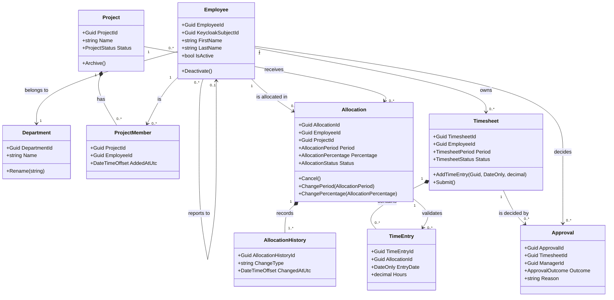
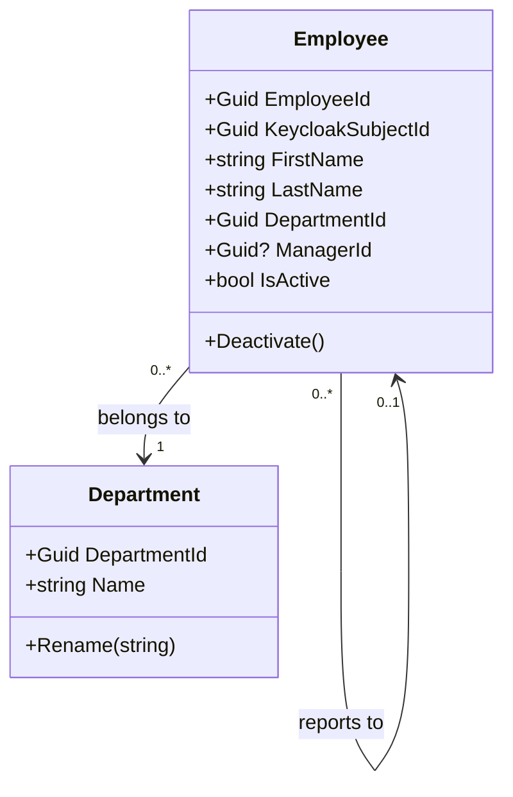
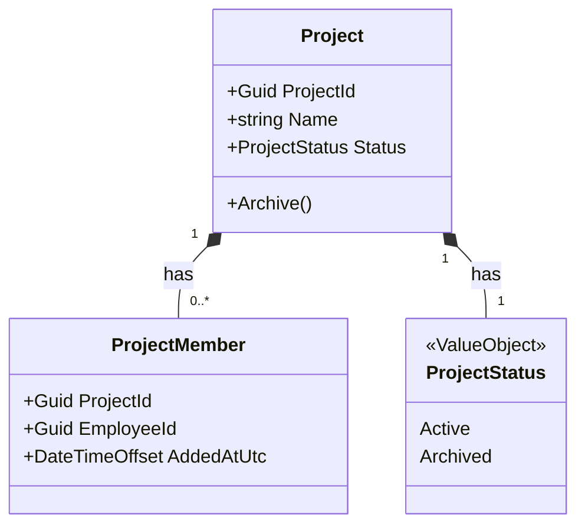
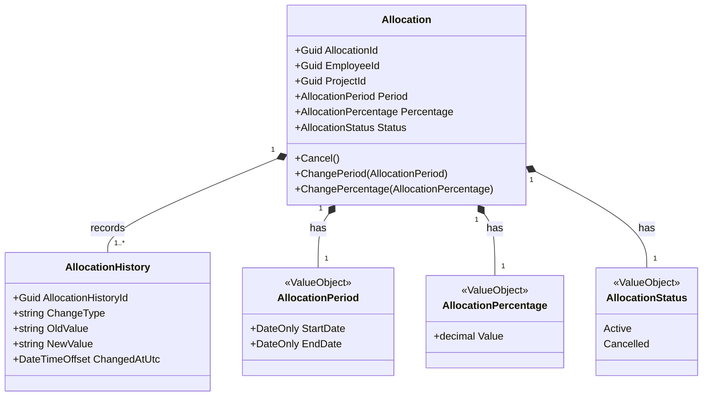
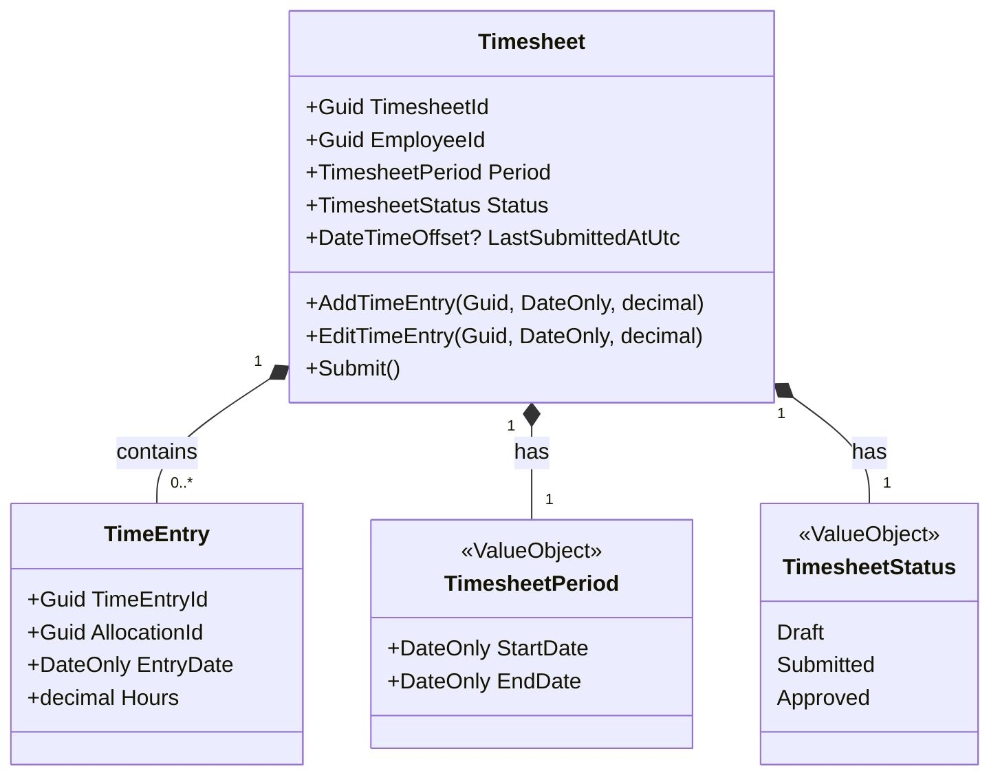
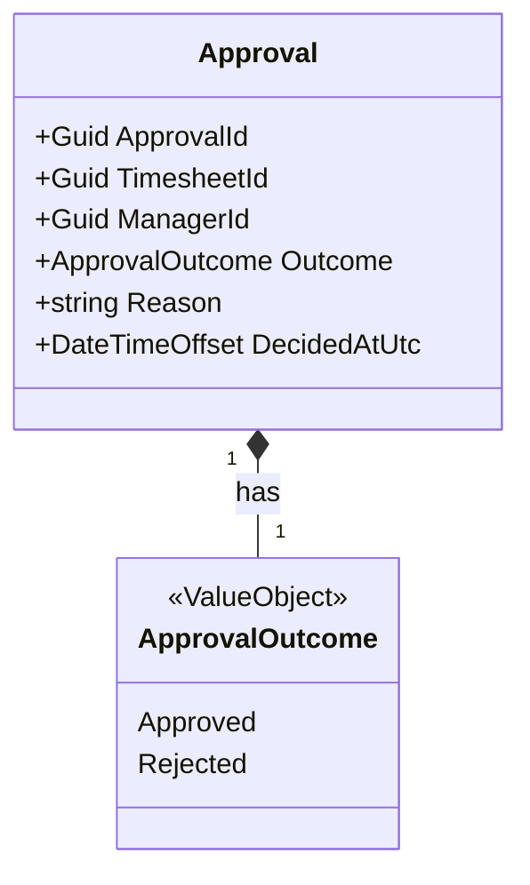

# 10 — Class Diagrams

**Document ID:** SYS-010
**Status:** Draft — pending review
**Version:** 1.0.0

---

## 1. Purpose

`06-domain-model.md` described Chrona v1's aggregates, entities, and value objects in prose, one at a time. This document draws the same model as a set of class diagrams — the static object structure a developer would actually build in C#: which classes exist, what they hold, what they can do, and exactly how they relate to each other. Nothing here is new; everything here is `06-domain-model.md`, redrawn.

---

## 2. Design Principles

**Why class diagrams are useful.** A class diagram shows what `06-domain-model.md` already said, but as one connected picture instead of nine separate write-ups — every relationship visible at once, not reconstructed by cross-referencing nine sections.

**Relationship to the Domain Model.** This document adds no new concept, invariant, or rule beyond what `06-domain-model.md` already established. It exists purely to render that document's aggregates, entities, and value objects as an object model — including the relationship types (inheritance, composition, aggregation, association) that prose doesn't distinguish as precisely as a diagram can.

**Relationship to the ER Diagram.** `07-er-diagram.md` shows the same underlying model from a different angle — rows and foreign keys, oriented around storage. This document shows objects and references, oriented around behavior. The two look similar because they describe the same domain, but they answer different questions: the ER diagram answers "what does a row look like, and what does deleting it do"; this document answers "what does an object know how to do, and what does it hold a reference to."

**Relationship to Clean Architecture.** Every class here belongs to a module's Domain layer (`03-module-design.md`) — no Application, Infrastructure, or Contracts-layer type appears in this document. This is deliberate: a class diagram of the domain should be readable without knowing which database, ORM, or web framework the application is built on, and every class here would still make sense if `ADR-002` had chosen a different database entirely.

---

## 3. High-Level Domain Class Diagram

Nine classes, matching `06-domain-model.md`'s nine entities exactly. Value Objects are omitted from this diagram to keep it readable at the whole-domain scale — each appears in its owning aggregate's diagram in Section 4 instead. No inheritance and no aggregation appear here; Section 5 explains why neither fits this model.

---

## 4. Aggregate Diagrams

### Workforce

- **Aggregate Roots:** `Employee`, `Department` — two separate aggregates, not one, since neither's invariants require locking the other (`06-domain-model.md`, Section 3).
- **Entities:** none beyond the two roots themselves.
- **Value Objects:** none in v1 — name and the Department/Manager references are simple attributes, not rich enough to justify a dedicated type (`06-domain-model.md`, Section 3).
- **Responsibilities:** be the single source of truth for who works at the organization, how they're organized, and the mapping from an authenticated principal to an Employee (`03-module-design.md`).
- **Invariants:** an Employee must resolve to exactly one Keycloak subject ID; must reference exactly one Department; may not be their own Manager; a Department cannot be removed while Employees are still assigned to it (`06-domain-model.md`, Section 3, as revised).

### Project Management

- **Aggregate Root:** `Project`.
- **Entities:** `ProjectMember`.
- **Value Objects:** `ProjectStatus`.
- **Responsibilities:** own the existence and membership of Projects, independent of how work is allocated against them (`06-domain-model.md`, Section 2).
- **Invariants:** a Project's name must be non-empty and unique; an archived Project accepts no new Members and no new Allocations, but existing ones are unaffected; archiving is permanent in v1 (`06-domain-model.md`, Section 3).

### Work Allocation

- **Aggregate Root:** `Allocation` — the core domain (`06-domain-model.md`, Section 2).
- **Entities:** `AllocationHistory`.
- **Value Objects:** `AllocationPeriod`, `AllocationPercentage`, `AllocationStatus`.
- **Responsibilities:** reserve an Employee's capacity against a Project for a period, and protect that reservation from ever exceeding what's available.
- **Invariants:** the sum of an Employee's overlapping active Allocations may never exceed 100%; `EmployeeId` and `ProjectId` are immutable after creation; only Period and Percentage may change; every transition and change is recorded in `AllocationHistory`, starting with creation itself (`06-domain-model.md`, Section 3, as revised).

### Time Management

- **Aggregate Root:** `Timesheet`.
- **Entities:** `TimeEntry`.
- **Value Objects:** `TimesheetStatus`, `TimesheetPeriod`.
- **Responsibilities:** collect one Employee's Time Entries for a reporting period, and carry that collection through submission and decision.
- **Invariants:** a Time Entry may only be added or edited while the Timesheet is in Draft; each Time Entry's Allocation must be active and cover the entry's date, and — per `07-er-diagram.md`'s revision — the entry's date must also fall within the Timesheet's own period; a Timesheet cannot be submitted empty; an Approved Timesheet is immutable (`06-domain-model.md`, Section 3).

### Approval Workflow

- **Aggregate Root:** `Approval`.
- **Entities:** none.
- **Value Objects:** `ApprovalOutcome`.
- **Responsibilities:** record a Manager's decision about one submission of a Timesheet, without owning the Timesheet itself.
- **Invariants:** the deciding Manager must have authority over the Timesheet's owning Employee; a Manager may not decide on their own Timesheet; a rejection requires a reason; a decision, once recorded, is never edited (`06-domain-model.md`, Section 3).

---

## 5. Relationships

Every relationship in Sections 3 and 4 corresponds exactly to one already explained in full in `07-er-diagram.md`, Section 4 — cardinality, ownership, and reasoning are not repeated here. What's new at the class-diagram level is the composition/association distinction itself, which an ER diagram has no notation for.

**Composition** (filled diamond) — used only where the child is a true part of its parent's aggregate, with no independent existence (`06-domain-model.md`'s "Owned Entities," Section 3):
- `Project *— ProjectMember`
- `Allocation *— AllocationHistory`
- `Timesheet *— TimeEntry`

Every Value Object is composed into its owning entity for the same reason at a smaller scale — a Value Object has no identity of its own and cannot be referenced independently (`06-domain-model.md`, Section 5).

**Association** (plain line) — used for every relationship that crosses an aggregate boundary, whether or not it also crosses a module boundary: `Employee → Department`, `Employee → Employee` (reports to), `Employee → ProjectMember`, `Employee → Allocation`, `Project → Allocation`, `Employee → Timesheet`, `Allocation → TimeEntry`, `Timesheet → Approval`, `Employee → Approval`. None of these are composition, even where one class's data depends on another existing — `Allocation` needs a real `Employee` to exist, but does not own that Employee's lifecycle, and never will, per `06-domain-model.md`'s aggregate boundaries.

**Aggregation and inheritance do not appear in this model.** Aggregation — a whole-part relationship where the part still has independent lifecycle and identity — doesn't fit anything here: every whole-part-shaped relationship in this domain is either full composition (the part has no independent existence at all) or a plain association between two separate aggregate roots (neither owns the other in any sense). Nothing sits in between. Inheritance is absent for a simpler reason: none of Chrona v1's nine domain classes specialize one another. Each represents a distinct business concept with its own identity and lifecycle — forcing a shared supertype where the domain doesn't ask for one would be exactly the kind of abstraction `03-module-design.md`'s own principles ask to be justified by more than habit.

---

## 6. Notes

Every class in this document is a domain class, not a database table, and the difference is more than naming:

- A domain class can have behavior — `Allocation.Cancel()`, `Timesheet.Submit()` — a table cannot. Tables store the *result* of calling `Cancel()`; they don't know what calling it means or what it's allowed to do.
- A Value Object (`AllocationPeriod`, `TimesheetStatus`, and so on) is a real, small class with its own validation rules (`06-domain-model.md`, Section 5). In `07-er-diagram.md` and `08-database-design.md`, the same information becomes plain columns on the owner's table, because a relational schema has no way to represent "a class with no identity of its own."
- A domain class's associations to other aggregates are references by ID (`Allocation.EmployeeId`) — the same information a foreign key carries — but a domain class never navigates that reference as an object, the way `Timesheet` navigates its own `TimeEntry` collection. `06-domain-model.md` and `03-module-design.md` both establish why: navigating across an aggregate or module boundary as if it were owned data is exactly the coupling those documents exist to prevent.
- This document looks almost identical to `07-er-diagram.md` at a glance, and that's expected — the two describe the same domain from persistence and object-orientation angles, not two different domains. Where they'd diverge is behavior: this document is where `Allocation`'s capacity check or `Timesheet`'s status transitions actually live in code; `07-er-diagram.md` only shows what the aftermath looks like in a row.

10-class-diagrams.md complete.