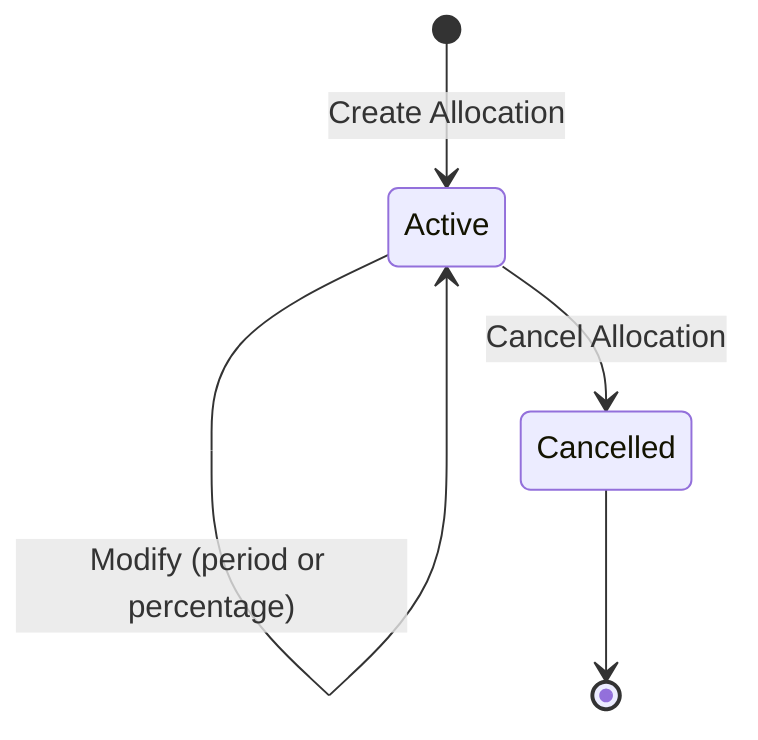
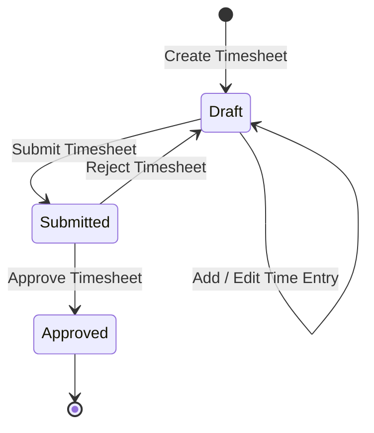
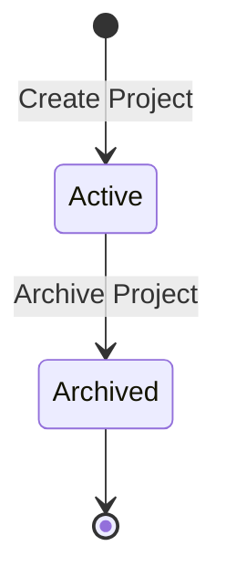

# 11 — State Diagrams

**Document ID:** SYS-011
**Status:** Draft — pending review
**Version:** 1.0.0

---

## 1. Purpose

`10-class-diagrams.md` showed what Chrona v1's domain classes look like at rest. This document shows the three that actually change shape over time — `Allocation`, `Timesheet`, and `Project` are the only entities in `06-domain-model.md` with a status value object and a defined set of transitions between its values. Everything else in the domain either has no status at all (`Employee`, `Department`, `ProjectMember`) or is create-once and immutable (`AllocationHistory`, `TimeEntry`, `Approval`). A state diagram for any of those would be a single dot — this document only covers where the shape is actually interesting.

---

## 2. Allocation

**Purpose:** track an Allocation's lifecycle from creation through to cancellation, and the ongoing changes it can undergo while active.

**Initial state:** Active — reached immediately on creation. There is no separate "Created" state, only the transition into Active (`06-domain-model.md`, Section 3).

**Final state:** Cancelled — terminal; no further transitions occur once reached.

**Allowed transitions**

| From | To | Trigger |
|---|---|---|
| `[*]` | Active | Create Allocation |
| Active | Active | Modify Allocation (change Period or Percentage) |
| Active | Cancelled | Cancel Allocation |

**Business rules enforced during transitions:**
- Create Allocation: the Employee must exist and be active, the Project must exist and be active, and the new Allocation must not push the Employee's overlapping active Allocations past 100% (`06-domain-model.md`, Sections 3 and 6; `09-sequence-diagrams.md`, Create Allocation).
- Modify Allocation: only Period and Percentage may change — `EmployeeId` and `ProjectId` are immutable for the Allocation's entire lifetime; the modified values are re-validated against the same capacity rule.
- Every transition, including the initial Create, writes an entry to `AllocationHistory` (`06-domain-model.md`, Section 3, as revised in `07-er-diagram.md`'s review).

**Invalid transitions:**
- Cancelled → Active: rejected. Reactivating a cancelled Allocation isn't a "modify," it's a new planning decision, and `06-domain-model.md` never defines a path back — a Manager who wants the same reservation again creates a new Allocation.
- Active → "Completed": doesn't exist. `06-domain-model.md` is explicit that an Allocation whose period has simply elapsed is still Active in status terms — there is no automatic transition when a period ends, only the two transitions shown above.

**Notes:** "Modified" in the expected lifecycle for this document is a transition, not a state — the actual stored `AllocationStatus` has exactly two values, Active and Cancelled (`06-domain-model.md`, Section 5). Showing it as a self-loop on Active, rather than its own bubble, is a direct, faithful rendering of that decision, not a simplification of it.

---

## 3. Timesheet

**Purpose:** track a Timesheet from creation through submission to a final decision, including the one path that loops backward.

**Initial state:** Draft — reached immediately on creation.

**Final state:** Approved — terminal; no further transitions occur once reached. (Rejected is not a state this diagram reaches as an endpoint — see Notes.)

**Allowed transitions**

| From | To | Trigger |
|---|---|---|
| `[*]` | Draft | Create Timesheet |
| Draft | Draft | Add Time Entry / Edit Time Entry |
| Draft | Submitted | Submit Timesheet |
| Submitted | Approved | Approve Timesheet |
| Submitted | Draft | Reject Timesheet |

**Business rules enforced during transitions:**
- Draft → Draft: a Time Entry may only be added or edited while the Timesheet is in Draft (`06-domain-model.md`, Section 3).
- Draft → Submitted: the Timesheet must contain at least one Time Entry (`04-use-cases.md`, Submit Timesheet; `09-sequence-diagrams.md`, Submit Timesheet).
- Submitted → Approved: the deciding Manager must have authority over the owning Employee, and must not be the Timesheet's own Employee (`06-domain-model.md`, Section 3; `09-sequence-diagrams.md`, Approve Timesheet).
- Submitted → Draft: the same authority check applies, and a reason is mandatory (`06-domain-model.md`, Section 3; `09-sequence-diagrams.md`, Reject Timesheet).

**Invalid transitions:**
- Approved → anything: rejected. Approved is terminal and immutable — "approval does not modify history" (`06-domain-model.md`, Section 3) — and that extends to the Timesheet itself never leaving the Approved state once reached.
- Draft → Approved, skipping Submitted: rejected. A decision can only be made about a submission that exists; there is no path letting a Manager approve a Timesheet the owning Employee hasn't submitted.

**Notes:** The expected lifecycle for this document lists "Rejected" as its own step, before "Returned to Draft after rejection." This diagram models that as one transition, not two. `06-domain-model.md` and `07-er-diagram.md` are both explicit, and — after a dedicated review pass — both frozen on this point: `TimesheetStatus` has exactly three values, Draft, Submitted, and Approved, and there is no stored "Rejected" value (`06-domain-model.md`, Section 5). A rejection *is* the transition from Submitted back to Draft; the fact that it happened, and why, is recorded on a separate `Approval` record (`06-domain-model.md`, Section 3), not as a fourth Timesheet state. If a persistent "Rejected" state was actually intended, that would be a change to a decision already frozen in two prior documents — flagged here rather than silently decided either way.

---

## 4. Project

**Purpose:** track a Project from creation to archival — the simplest lifecycle in this document.

**Initial state:** Active — reached immediately on creation.

**Final state:** Archived — terminal; no further transitions occur once reached.

**Allowed transitions**

| From | To | Trigger |
|---|---|---|
| `[*]` | Active | Create Project |
| Active | Archived | Archive Project |

**Business rules enforced during transitions:**
- Create Project: the name must be non-empty and unique (`06-domain-model.md`, Section 3; `05-business-processes.md`, Project Creation).
- Active → Archived: once archived, the Project accepts no new Project Members and no new Allocations — existing ones are unaffected (`06-domain-model.md`, Section 3; `05-business-processes.md`, Project Member Assignment and Employee Allocation).

**Invalid transitions:**
- Archived → Active: rejected. `06-domain-model.md` and `04-use-cases.md` both treat archiving as permanent in v1 — reactivation was raised as an Open Question in `04-use-cases.md` and has never been decided, so no transition back exists in this diagram.

**Notes:** This is the only one of the three lifecycles with no self-loop and no backward transition — a Project's state, once set, only ever moves in one direction, and only once.

11-state-diagrams.md complete.