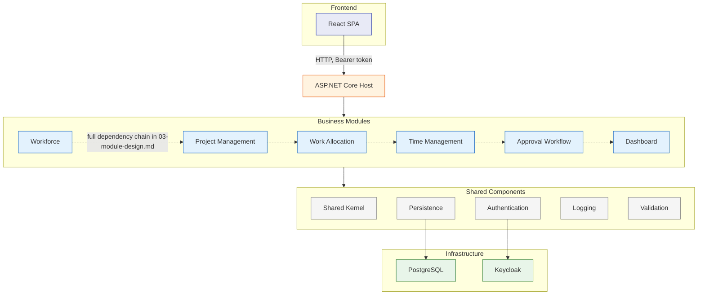
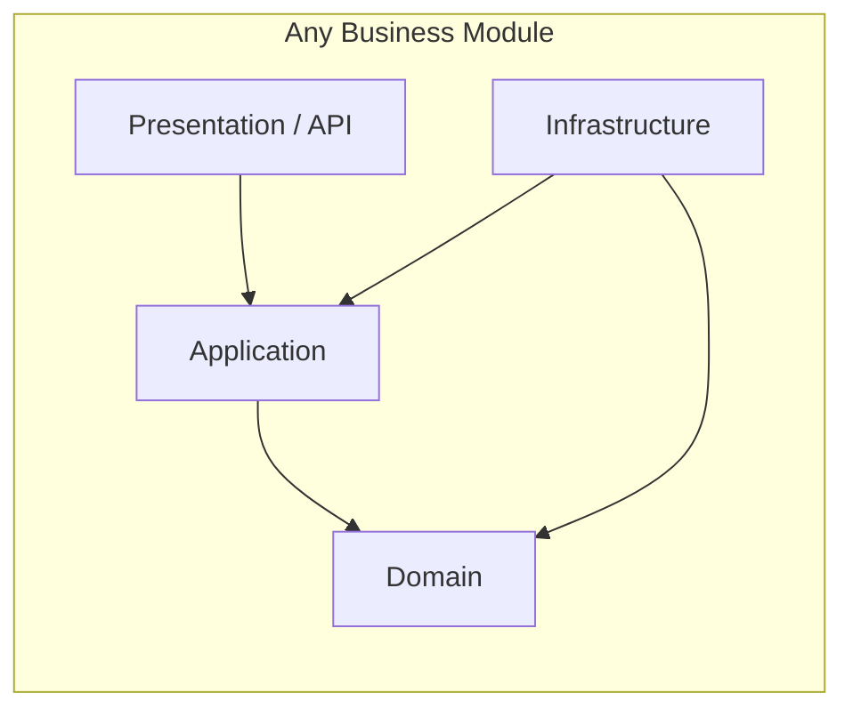

# 12 — Component Diagram

**Document ID:** SYS-012
**Status:** Draft — pending review
**Version:** 1.0.0

---

## 1. Purpose

Every document so far has described Chrona v1's *domain* — what it models and how that model behaves. This document describes the *software* that implements it: the actual components inside the Modular Monolith, how they're layered, and which dependencies between them are allowed. `03-module-design.md` already established the module boundaries and the rules governing them; this document sits one level up, showing where those modules physically live inside one running process, and what surrounds them.

---

## 2. Architectural Overview

**Modular Monolith.** One deployable process containing every module, with enforced internal boundaries — chosen in `ADR-001` because it matches a self-hosted, single-instance-per-organization deployment, without the operational cost of independently deployable services the project has no evidence it needs yet.

**Clean Architecture.** Within each module, dependencies point inward — Infrastructure depends on Application and Domain; Application depends on Domain; Domain depends on nothing. `06-domain-model.md`'s domain classes have no knowledge of PostgreSQL, EF Core, or ASP.NET Core; `08-database-design.md`'s persistence details live entirely in a layer the Domain never sees.

**Vertical Slice Architecture.** Each use case from `04-use-cases.md` is implemented as its own thin, self-contained slice — a command or query, its handler, and its validation — rather than spread across broad, shared service classes. A change to Submit Timesheet touches one slice, not a `TimesheetService` god-class other features also depend on.

**Why these work well together.** Modular Monolith draws the outer boundary, between modules. Clean Architecture draws the inner boundary, between layers inside one module. Vertical Slice Architecture decides how work is organized inside that inner boundary — by use case, not by technical layer-spanning service. None substitutes for the others: a Modular Monolith without Clean Architecture would still let a module's Infrastructure leak into its Domain; Clean Architecture without Vertical Slices would still centralize a module's logic into broad services that unrelated features compete to modify.

---

## 3. High-Level Component Diagram

This diagram shows communication paths only — module-to-module detail is `03-module-design.md`'s job, not this one's; it's referenced here, not repeated. `Modules --> Shared` stands in for every module depending on every shared component identically, rather than drawing thirty near-identical edges.

---

## 4. Internal Module Structure

Every business module — Workforce, Project Management, Work Allocation, Time Management, Approval Workflow, Dashboard — follows the same four-layer structure internally. This is what Clean Architecture and Vertical Slice Architecture mean at the module level, not just the whole-system level shown in Section 3.

- **Presentation/API:** receives the request from the ASP.NET Core Host's routing, translates it into a command or query, and translates the result back into a response. Holds no business logic — this is the only layer that ever sees ASP.NET Core types directly.
- **Application:** orchestrates one use case per handler (`04-use-cases.md`), calling Domain objects to do the actual work, calling other modules' exposed Contracts when a cross-module dependency exists (`03-module-design.md`, Section 2), and defining the interfaces Infrastructure implements.
- **Domain:** the aggregates, entities, value objects, and invariants from `06-domain-model.md`, exactly as written there — no framework types, nothing that would need to change if `ADR-002` had chosen a different database.
- **Infrastructure:** implements the interfaces Application defines — the EF Core configuration and queries from `08-database-design.md`, and any adapter to an external system. Depends on Domain and Application; nothing above ever depends on Infrastructure directly.

---

## 5. Component Responsibilities

**React SPA.** The single Frontend client — renders the UI, holds the OIDC/PKCE token exchange (`09-sequence-diagrams.md`, User Login), and calls the ASP.NET Core Host for everything else. Holds no business logic of its own; any validation the user sees before submitting is a convenience, not a source of truth — the real check always happens server-side.

**ASP.NET Core Host.** The single composition root and entry point for every request. Hosts the JWT-validation middleware, routes each request to the correct module's Presentation/API layer, and is the only place all six modules and every shared component are wired together into one running process (`ADR-001`).

**Shared Kernel.** The small set of types every module is allowed to depend on without that being considered cross-module coupling — common base abstractions for entities and value objects, and the `ICurrentUserContext` contract that Authentication fulfills (`03-module-design.md`, Section 3's own distinction between Authentication's foundational role and a true bounded context).

**Workforce.** Single source of truth for who works at the organization and how they're organized (`03-module-design.md`).

**Project Management.** Owns the existence and membership of Projects, independent of how work is allocated against them (`03-module-design.md`).

**Work Allocation.** The core domain — reserves Employee capacity against Projects and protects that reservation from ever being exceeded (`03-module-design.md`, `06-domain-model.md`, Section 2).

**Time Management.** Captures what Employees actually did, against what was planned (`03-module-design.md`).

**Approval Workflow.** Makes the business decision of whether submitted work is accepted (`03-module-design.md`).

**Dashboard.** A pure, read-only consumer of the other five business modules; owns no data of its own (`03-module-design.md`).

**PostgreSQL.** The single shared database (`ADR-002`, `ADR-005`) — one physical instance, with each module owning and migrating only the tables listed under it in `08-database-design.md`, Section 5.

**Keycloak.** The external identity provider (`ADR-003`, `02-system-context.md`) — issues and validates tokens, owns no business data, and sits outside Chrona's own system boundary.

---

## 6. Dependency Rules

**Shared Kernel dependencies.** Every module may depend on Shared Kernel; Shared Kernel depends on nothing in return — no business module, no Application or Domain type from anywhere else. This is what keeps it shared rather than becoming its own hidden bounded context.

**Module isolation.** A module's Domain and Infrastructure are never referenced by another module — only its Contracts (`03-module-design.md`, Section 4). This document doesn't repeat the full dependency graph; see `03-module-design.md`, Section 2 for every edge and its justification.

**Cross-module communication.** Synchronous, in-process Application-layer calls by default; the one domain event in this system (`06-domain-model.md`, Section 7) is the sole exception (`03-module-design.md`, Section 5).

**Database ownership.** One shared PostgreSQL instance, but each module owns and migrates only its own tables (`08-database-design.md`, Sections 2 and 5) — sharing a database is not the same as sharing ownership of what's in it.

**Why direct module coupling is forbidden.** A direct reference to another module's Domain or Infrastructure would mean a change inside that module could silently break a caller nobody reviewing the change would think to check — exactly the failure mode `03-module-design.md`, Section 1 describes modularity as existing to prevent.

---

## 7. Design Decisions

**Why Modular Monolith.** `ADR-001` — matches a self-hosted, single-organization deployment; avoids the operational cost of independently deployable services with no current evidence they're needed; preserves a real path to extraction later if that changes.

**Why Clean Architecture.** Keeps `06-domain-model.md`'s domain classes framework-independent — `ADR-002`'s database choice, or any future choice, never needs to change what an `Allocation` is or how it enforces capacity.

**Why Vertical Slice.** `04-use-cases.md` already organizes the system by what a user is trying to do; Vertical Slice Architecture is the implementation-level mirror of that same organization — one slice per use case, rather than routing every feature through broad, shared service classes that become a coordination bottleneck as more use cases are added.

**Why DDD.** `06-domain-model.md`'s aggregates and invariants exist because this system's business rules — capacity limits, approval authority, immutability after decision — are genuinely non-trivial. A simpler, CRUD-oriented model would have nowhere to put "an approved timesheet is immutable" except scattered validation checks with no single owner; DDD gives that rule, and every rule like it, exactly one home.

12-component-diagram.md complete.