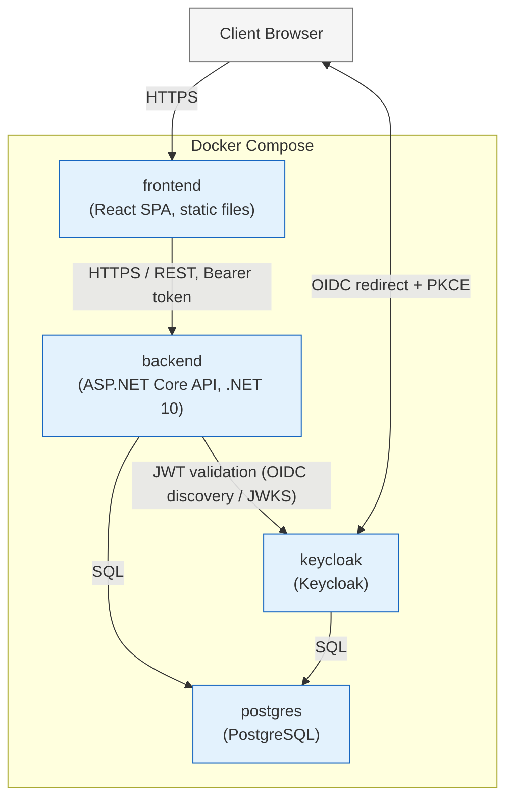

# 13 — Deployment Diagram

**Document ID:** SYS-013
**Status:** Draft — pending review
**Version:** 1.0.0

---

## 1. Purpose

`12-component-diagram.md` described Chrona's software structure — modules, layers, dependencies — independent of where any of it actually runs. This document describes where it runs: which containers exist, what's inside each one, and which network hops separate a person clicking a button in their browser from a row changing in PostgreSQL. The same component diagram could deploy several different ways; this document commits to the one Chrona v1 actually uses.

---

## 2. Deployment Overview

Chrona v1 deploys as four containers on one Docker host: the React SPA, the ASP.NET Core (.NET 10) backend, PostgreSQL, and Keycloak, all started together via Docker Compose (`ADR-004`). There is no orchestration platform, no separate application-server tier, and no distributed component of any kind — one host runs everything a single organization needs.

This matches the project's actual constraints directly. `ADR-004` already established that Chrona is self-hosted, one deployment per organization, run entirely on infrastructure the customer controls — a small organization, the scale `01-system-overview.md` scopes this system for, doesn't need, and shouldn't have to operate, anything more than a single Docker Compose stack on one machine. `ADR-001`'s Modular Monolith is what makes this possible: because every business module lives inside one process (`12-component-diagram.md`), the backend is exactly one container, not six.

---

## 3. Deployment Diagram

Mermaid has no dedicated deployment-diagram syntax, so this uses a flowchart, with the Docker Compose stack drawn as a single boundary containing all four containers. Two additions beyond the shape requested, both necessary for consistency with `09-sequence-diagrams.md` rather than optional embellishment: `Browser <--> Keycloak` — the login redirect and PKCE exchange happen directly between the browser and Keycloak, not through the backend — and `Keycloak --> postgres` — Keycloak uses the same PostgreSQL server as Chrona rather than its own, explained in Section 6.

---

## 4. Runtime Components

**Browser.** Not a Chrona component, but the one runtime participant every other component ultimately serves — runs the SPA's JavaScript, holds the session's tokens in memory, and is the only place credentials are ever entered, at Keycloak's own hosted page (`09-sequence-diagrams.md`).

**React Frontend (`frontend` container).** Serves the built SPA as static files. Once loaded into the browser, the application runs client-side; the container's only runtime job is handing over that initial bundle.

**ASP.NET Core Host (`backend` container).** The one process running all six business modules and every shared component (`12-component-diagram.md`). The only container that talks to PostgreSQL for Chrona's own data, and the only one that validates incoming JWTs.

**PostgreSQL (`postgres` container).** The single shared database, holding both Chrona's own tables (`08-database-design.md`) and Keycloak's — one Postgres server, two logical databases, not two separate database containers.

**Keycloak (`keycloak` container).** The identity provider, reachable by both the backend (for token validation) and the browser directly (for the login redirect itself, `09-sequence-diagrams.md`) — the one component with two distinct callers at runtime, for two different reasons.

---

## 5. Network Communication

- **Browser → React Frontend:** HTTPS, retrieving the SPA's static assets.
- **Browser ↔ Keycloak:** HTTPS, OIDC — the login redirect and PKCE code exchange happen directly between the browser and Keycloak, not proxied through the backend (`09-sequence-diagrams.md`). Not one of the four paths this document was asked to cover, but included for consistency with how login actually works.
- **React Frontend → ASP.NET Core API:** HTTPS, REST, JSON — every request after login carries the access token as a Bearer header.
- **ASP.NET Core API → PostgreSQL:** a direct SQL connection, internal to the Docker network — never exposed outside it.
- **ASP.NET Core API ↔ Keycloak:** HTTPS, OIDC — the API fetches Keycloak's OIDC discovery document and JWKS to validate incoming JWTs (`02-system-context.md`). This direction needs no PKCE and no redirect; it's a server-to-server metadata fetch, not a login.

---

## 6. Docker Compose Layout

Four services, one Compose file, one shared Docker network — every service reaches every other by its service name (`backend` resolves `postgres` and `keycloak` as hostnames, not IP addresses or external URLs).

- **frontend:** builds and serves the React SPA's static output. No persistent state.
- **backend:** runs the ASP.NET Core Host. No persistent state of its own — everything it needs to remember lives in `postgres`.
- **postgres:** the one stateful service in this deployment. Backed by a single persistent volume, so Chrona's data and Keycloak's realm configuration both survive a container restart or image upgrade.
- **keycloak:** configured to use the `postgres` service as its own database rather than its default embedded store — this is why it needs no volume of its own; its state is exactly as durable as `postgres`'s volume, and no more.

Only `postgres` should never be reachable from outside the Docker network. `frontend`, `backend`, and `keycloak` all need some external reachability — `keycloak` specifically because the browser reaches it directly, not only the backend.

No `docker-compose.yml` is generated here, per instructions — this section describes the layout, not the file.

---

## 7. Configuration

Every container is configured through environment variables, not files baked into an image — the same image runs in any environment by changing what's injected at startup.

- **Database connection:** the `backend` container reads a connection string (e.g., `ConnectionStrings__Chrona`) pointing at the `postgres` service by name, never a hardcoded host or IP.
- **Keycloak URL:** both `backend` and `frontend` need Keycloak's issuer URL (e.g., `Keycloak__Authority`) — the backend to validate tokens, the frontend to start the login redirect.
- **Client ID:** the SPA's registered OIDC client identifier (e.g., `Keycloak__ClientId`) — public information, safe to ship in the frontend bundle, unlike a secret.
- **Secrets:** database credentials and any Keycloak admin credentials are injected as environment variables at container startup, never committed to source control and never hardcoded in an image (`CODING_STANDARDS.md`'s "never hardcode secrets," still in force). No real value appears in this document or any other.

---

## 8. Deployment Decisions

**Why Docker Compose.** `ADR-004` — matches a single, self-hosted deployment exactly; no orchestration platform is justified at this scale, and Compose is the simplest tool that reliably starts four related containers together.

**Why PostgreSQL.** `ADR-002` — already decided, unaffected by deployment; also lets `keycloak` share the same database server as Chrona rather than needing its own.

**Why Keycloak.** `ADR-003` — self-hostable, avoiding both a custom-built identity system and a dependency on a third-party SaaS identity provider.

**Why a single deployment.** `ADR-004` — one organization, one instance, run on infrastructure that organization controls. Chrona is not a centrally-hosted product serving multiple customers from one deployment.

**Why Modular Monolith.** `ADR-001` — the reason `backend` is one container instead of six. Every module lives in one process, so the deployment surface stays exactly as small as the architecture allows.

13-deployment-diagram.md complete.