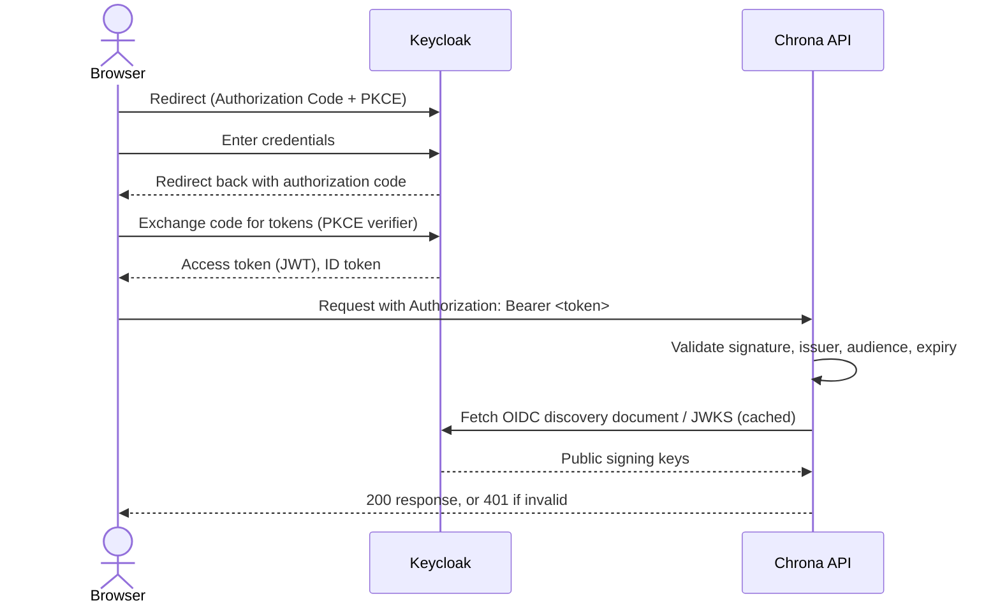

# 15 — Security Model

**Document ID:** SYS-015
**Status:** Draft — pending review
**Version:** 1.0.0

---

## 1. Purpose

Security has appeared throughout this document set already — JWT validation in `02-system-context.md`, role checks in `04-use-cases.md`'s Permission Matrix, `CHECK` constraints in `08-database-design.md`, HTTPS and secrets handling in `13-deployment-diagram.md`. This document doesn't add a new mechanism to any of that; it collects what's already decided into one place, organized around security concerns specifically, so the whole picture is checkable in one document instead of five.

---

## 2. Security Objectives

**Authentication.** Establishing who is making a request. Delegated entirely to Keycloak (`ADR-003`); Chrona never sees or handles a password.

**Authorization.** Establishing what an authenticated identity may do. Enforced as role-based access control against the roles carried in the JWT (`04-use-cases.md`, Permission Matrix; `14-api-design.md`, Section 3).

**Confidentiality.** Keeping data readable only by those authorized to read it. HTTPS in transit (`13-deployment-diagram.md`, Section 5); no secret or credential ever hardcoded or logged (`13-deployment-diagram.md`, Section 7).

**Integrity.** Keeping data correct and un-tampered-with. JWT signatures prevent a forged or altered token from validating (`02-system-context.md`); database `CHECK` constraints and foreign keys (`08-database-design.md`) are a second line of defense against invalid data even if application code has a bug.

**Auditability.** Being able to reconstruct what happened. `AllocationHistory` records every change to an Allocation, including its creation (`06-domain-model.md`, Section 7); every `Approval` record permanently identifies who decided, what they decided, when, and why for a rejection (`06-domain-model.md`, Section 3).

---

## 3. Authentication

Login is handled entirely by Keycloak, using the OpenID Connect Authorization Code flow with PKCE (`02-system-context.md`, `09-sequence-diagrams.md`). The browser redirects to Keycloak's own hosted login page; Chrona's frontend never collects or sees a password. After a successful login, the browser exchanges the resulting authorization code directly with Keycloak for an access token — a JWT — and an ID token.

Every subsequent request to the Chrona API carries that access token in the `Authorization: Bearer <token>` header (`14-api-design.md`, Section 3). The API validates the token's signature against Keycloak's published JWKS, and checks its issuer, audience, and expiry (`02-system-context.md`) — all before the request reaches any module. A request with a missing, expired, or invalid token is rejected at this single point, uniformly, not re-implemented per endpoint.

Logout clears the local session and redirects to Keycloak's end-session endpoint, invalidating the token at the identity provider itself, not only in the browser (`04-use-cases.md`, Logout).

This document does not go further into Keycloak's own configuration — realm setup, client registration, token lifetimes — beyond what Chrona's own authentication behavior depends on; that's Keycloak's internals, not Chrona's security model.

---

## 4. Authorization

**Role-Based Access Control (RBAC).** Chrona's API authorizes every request against a role carried in the validated JWT (`02-system-context.md`, `14-api-design.md`, Section 3). Two roles gate Chrona's own operations.

**Employee.** Every self-service operation `04-use-cases.md` grants an Employee: viewing their own profile and allocations, recording and submitting their own time. The baseline role — every Manager also holds it (`04-use-cases.md`, Section 2: Manager inherits every Employee use case).

**Manager.** Every operation beyond an Employee's own self-service: workforce and project administration, allocation, approval, and dashboard access (`04-use-cases.md`, Permission Matrix). A superset of Employee, not a separate, disjoint set of permissions.

**Administrator.** Named as a system actor in `01-system-overview.md`, but performs no operation inside Chrona's API at all. `02-system-context.md` and `04-use-cases.md` both establish this deliberately: user, role, and permission management happens entirely inside Keycloak's own admin console, a separate system with its own access model, outside Chrona's boundary. Consistent with that, no endpoint in `14-api-design.md` requires an Administrator role, and Chrona's own authorization logic never checks for one — "Administrator" describes who manages Keycloak, not a role Chrona's RBAC inspects.

---

## 5. Authentication Flow

This is the same underlying flow `09-sequence-diagrams.md`'s Login diagram already showed, narrowed here to the hops that matter for security specifically — token issuance and validation — rather than extended to the Workforce/PostgreSQL profile lookup that diagram also covers. Not a second, different flow; the same one, viewed more narrowly.

---

## 6. Protected Resources

| Module | Authentication Required | Roles That Can Access |
|---|---|---|
| Workforce | Yes | Employee (own profile only), Manager (full) |
| Project Management | Yes | Employee (read), Manager (read and write) |
| Work Allocation | Yes | Employee (read, own), Manager (full) |
| Time Management | Yes | Employee (own timesheets), Manager (read) |
| Approval Workflow | Yes | Manager only |
| Dashboard | Yes | Manager only |

Every endpoint in this system requires authentication — there is no public or anonymous endpoint anywhere in Chrona's API. This table summarizes access at the module level; the full per-endpoint breakdown, including which specific roles each individual endpoint requires, is `14-api-design.md`, Section 4.

---

## 7. Security Best Practices

**HTTPS.** Every network hop in `13-deployment-diagram.md`, Section 5 is HTTPS — browser to frontend, browser to Keycloak, frontend to API, API to Keycloak. The one connection that isn't is API to PostgreSQL, which never leaves the Docker network (`13-deployment-diagram.md`, Section 6).

**Password handling.** Chrona never receives, stores, or validates a password. That responsibility is delegated entirely to Keycloak (`ADR-003`) — removing an entire, security-critical surface area from this project's own code, not just outsourcing it.

**JWT validation.** Signature, issuer, audience, and expiry, checked on every request, before any module sees it (`02-system-context.md`). No endpoint trusts a token it hasn't validated itself, even if a prior request in the same session already validated one.

**Least privilege.** Two roles, not more, and no role grants more than `04-use-cases.md` actually assigns it. Cross-module authorization is equally narrow: Approval Workflow can ask Workforce whether a Manager has authority over an Employee, but cannot read or change anything else Workforce owns (`03-module-design.md`).

**Input validation.** Every request is validated for shape and type at the API boundary, via the shared Validation component (`12-component-diagram.md`), before it reaches a module — the `400` responses in `14-api-design.md`, Section 6. Business-rule validation happens separately, inside the module that owns the rule, and is what produces a `409` instead.

**Secure configuration.** Every credential and connection detail is supplied through environment variables at container startup, never hardcoded in an image or committed to source control (`13-deployment-diagram.md`, Section 7; `CODING_STANDARDS.md`'s "never hardcode secrets," still in force).

---

## 8. Design Decisions

**Why Keycloak.** `ADR-003` — open-source, self-hostable, and its Realm concept maps directly onto Chrona's own deployment model (`13-deployment-diagram.md`).

**Why OIDC.** A standard, widely-implemented protocol for exactly this problem — authenticating a user and issuing a verifiable token — rather than a custom authentication scheme this project would have to design, implement, and secure itself.

**Why JWT.** Self-contained and statelessly verifiable — the API validates a JWT using only Keycloak's public signing keys, with no server-side session store to query on every request (`14-api-design.md`, Section 8's stateless-API reasoning applies here too).

**Why RBAC.** `04-use-cases.md`'s Permission Matrix already showed the system needs exactly two meaningfully different levels of access, not a fine-grained permission system — RBAC is the simplest mechanism that matches the actual requirement, not an under-powered choice for it.

**Why an external identity provider**, rather than building authentication into Chrona itself. Authentication is security-critical, well-understood, and already solved by mature, widely-audited software; building it from scratch would mean Chrona owning a class of vulnerability (session handling, password storage, brute-force protection) that delegating to Keycloak removes entirely, not merely reduces.

15-security-model.md complete.